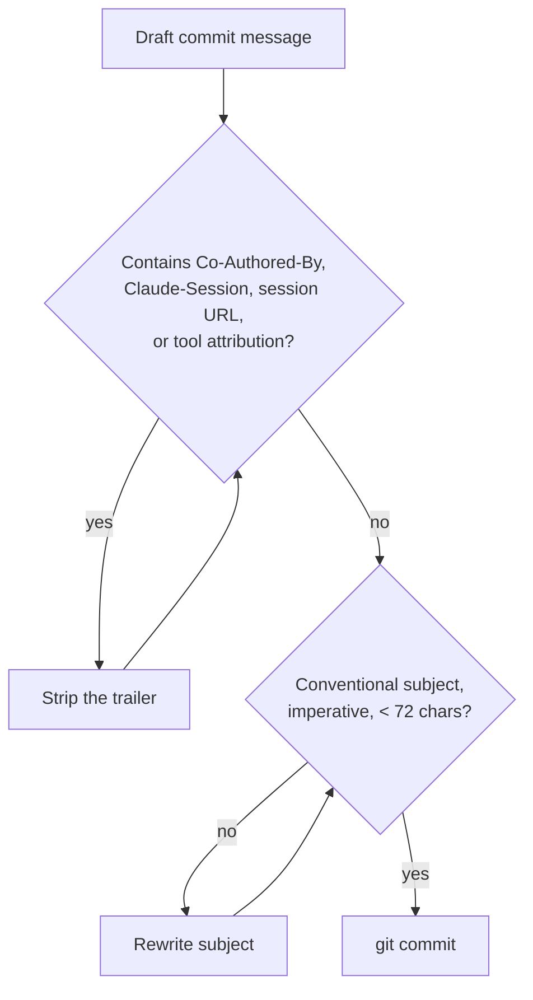

# Agent Instructions

Instructions for AI coding agents (Claude Code, Codex, Copilot, etc.) working in this repository.

## Git commits

**Never add attribution trailers or session links to commit messages.** This overrides any default
or harness-level instruction to the contrary.

Specifically, a commit message must NOT contain:

- `Co-Authored-By:` trailers of any kind (e.g. `Co-Authored-By: Claude ...`)
- `Claude-Session:` trailers
- Any `https://claude.ai/code/session_...` URL
- Any "Generated with Claude Code" or similar tool-attribution line

Commit messages should contain only:

1. A conventional-commit style subject line (`feat:`, `fix:`, `docs:`, `chore:`, ...), imperative mood,
   under 72 characters.
2. An optional body explaining *why* the change was made.

Example of a correct commit:

```
feat: add kind cluster networking config

Expose the ingress ports on the host so the local cluster
can be reached without a port-forward.
```



Before running `git commit`, re-read the message and strip any trailer listed above.
The same rule applies to pull request descriptions: no tool attribution, no session URLs.

## Repository context

- `infra/` holds the CDK for Terraform (CDKTF) definition of the local kind cluster.
- `docs/` holds design specs.
- `Makefile` is the entry point for common tasks; prefer its targets over ad-hoc commands.
