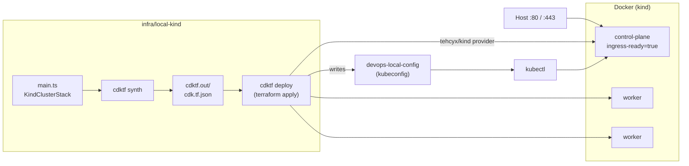

# devops

Personal DevOps practice repository. The goal is to get back up to speed on
Kubernetes, infrastructure as code and CI/CD, starting locally and moving to
AWS (EKS) later while keeping cloud cost down.

## What is here

| Path | Purpose |
| --- | --- |
| `infra/local-kind/` | Local [kind](https://kind.sigs.k8s.io/) cluster defined in TypeScript with [CDK for Terraform](https://developer.hashicorp.com/terraform/cdktf) |
| `ci/` | [Dagger](https://dagger.io) TypeScript module that typechecks, tests and synthesizes the stack; used by `make ci` and GitHub Actions |
| `.github/workflows/ci.yml` | Thin GitHub Actions shim that runs the Dagger module on push and pull request |
| `docs/ci.md` | How the CI pipeline works and how to run it locally |
| `docs/local-cluster.md` | How the local cluster works, prerequisites and usage |
| `docs/TODO.md` | Planned add-ons (ingress, metrics-server, local registry, sample app) |
| `docs/commands.md` | Terminal cheat sheet for exploring and operating the repo |
| `docs/alternatives.md` | Alternative tools at each layer of the stack (local cluster, IaC, add-ons, cloud, CI/CD) |
| `Makefile` | Entry point for common tasks (`make help`) |
| `AGENTS.md` | Instructions for AI coding agents working in this repo |

## Local cluster

The cluster is called `devops-local` and has one control-plane node and two
workers. Host ports 80 and 443 are mapped to the control-plane node so an
ingress controller can be added later without recreating the cluster.



### Prerequisites

Docker, kind, kubectl, Terraform, Node.js and pnpm. Tested versions are listed
in [docs/local-cluster.md](docs/local-cluster.md).

### Usage

```sh
make local-install   # once: pnpm install + cdktf get
make local-test      # Jest tests on the synthesized Terraform
make local-synth     # write Terraform JSON to cdktf.out/
make local-up        # create the cluster
make local-status    # kubectl get nodes using the generated kubeconfig
make local-down      # destroy the cluster
make ci              # same checks CI runs, via Dagger (see docs/ci.md)
```

The generated kubeconfig lives at
`infra/local-kind/cdktf.out/stacks/local-kind/devops-local-config`. To use it
directly:

```sh
export KUBECONFIG=$(pwd)/infra/local-kind/cdktf.out/stacks/local-kind/devops-local-config
kubectl get nodes
```

Terraform state is stored locally and git-ignored. If it is lost, remove the
cluster manually with `kind delete cluster --name devops-local`.

## Roadmap

- Local cluster add-ons listed in [docs/TODO.md](docs/TODO.md)
- EKS cluster on AWS defined with IaC
- CI pipeline done ([docs/ci.md](docs/ci.md)); CD deploying to a cluster still to come
- Automatic shutdown of cloud resources after a short idle window to control cost

## License

[MIT](LICENSE)
