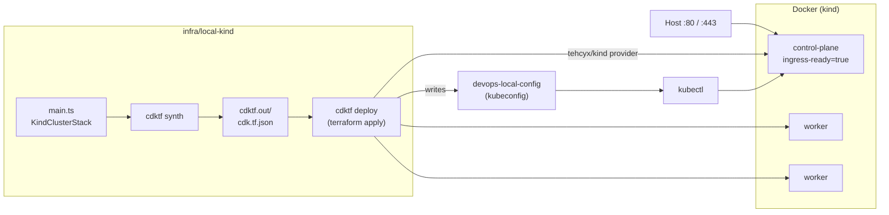

# devops

Personal DevOps practice repository. The goal is to get back up to speed on
Kubernetes, infrastructure as code and CI/CD, starting locally and mirroring
the same cluster on AWS while keeping cloud cost down.

## What is here

| Path | Purpose |
| --- | --- |
| `infra/local-kind/` | Local [kind](https://kind.sigs.k8s.io/) cluster defined in TypeScript with [CDK for Terraform](https://developer.hashicorp.com/terraform/cdktf) |
| `infra/aws-kind/` | The same kind cluster on one EC2 instance in `ap-southeast-1` that stops itself after an hour; CDKTF with the AWS provider and S3 state |
| `infra/dashboard/` | Grafana + Steampipe installed into either cluster to show Kubernetes and AWS resources side by side; CDKTF with the helm and kubernetes providers |
| `ci/` | [Dagger](https://dagger.io) TypeScript module that typechecks, tests and synthesizes the stack; used by `make ci` and GitHub Actions |
| `.github/workflows/ci.yml` | Thin GitHub Actions shim that runs the Dagger module on push and pull request |
| `docs/ci.md` | How the CI pipeline works and how to run it locally |
| `docs/local-cluster.md` | How the local cluster works, prerequisites and usage |
| `docs/aws-cluster.md` | How the AWS cluster works, how to reach it through SSM, and what it costs |
| `docs/dashboard.md` | How the in-cluster Grafana dashboard is built and what it shows |
| `docs/TODO.md` | Planned add-ons (ingress, metrics-server, local registry, sample app) |
| `docs/commands.md` | Terminal cheat sheet for exploring and operating the repo |
| `docs/alternatives.md` | Alternative tools at each layer of the stack (local cluster, IaC, add-ons, cloud, CI/CD) |
| `Makefile` | Entry point for common tasks (`make help`) |
| `AGENTS.md` | Instructions for AI coding agents working in this repo |

## Local cluster

The cluster is called `devops-local` and has one control-plane node and two
workers. Host ports 80 and 443 are mapped to the control-plane node so an
ingress controller can be added later without recreating the cluster.



### Prerequisites

Docker, kind, kubectl, Terraform, Node.js and pnpm. Tested versions are listed
in [docs/local-cluster.md](docs/local-cluster.md).

### Usage

```sh
make local-install   # once: pnpm install + cdktf get
make local-test      # Jest tests on the synthesized Terraform
make local-synth     # write Terraform JSON to cdktf.out/
make local-up        # create the cluster
make local-status    # kubectl get nodes using the generated kubeconfig
make local-down      # destroy the cluster
make ci              # same checks CI runs, via Dagger (see docs/ci.md)
```

The generated kubeconfig lives at
`infra/local-kind/cdktf.out/stacks/local-kind/devops-local-config`. To use it
directly:

```sh
export KUBECONFIG=$(pwd)/infra/local-kind/cdktf.out/stacks/local-kind/devops-local-config
kubectl get nodes
```

Terraform state is stored locally and git-ignored. If it is lost, remove the
cluster manually with `kind delete cluster --name devops-local`.

## AWS cluster

The same topology runs on a single `t3a.large` EC2 instance. User data installs
Docker and kind on boot, creates cluster `devops-aws`, and schedules
`shutdown -h +60`, so the instance stops itself after an hour and only the
disk is billed until the next `make aws-start`. The API server is reached
through an SSM port-forward; no SSH port or public API endpoint is opened.

```sh
make aws-install     # once: pnpm install + cdktf get
make aws-bootstrap   # once per account: S3 state bucket
make aws-up          # create the host (cluster ready ~4 min later)
make aws-kubeconfig  # fetch kubeconfig via SSM
make aws-tunnel      # second terminal: localhost:6443 -> cluster
make aws-status      # kubectl get nodes
make aws-down        # destroy host + network
```

Details, prerequisites and costs are in [docs/aws-cluster.md](docs/aws-cluster.md).

## Roadmap

- Local cluster add-ons listed in [docs/TODO.md](docs/TODO.md)
- AWS cluster done ([docs/aws-cluster.md](docs/aws-cluster.md)) with a fixed one-hour lifetime; EKS remains an option if managed control-plane practice is needed
- CI pipeline done ([docs/ci.md](docs/ci.md)); CD deploying to a cluster still to come

## License

[MIT](LICENSE)
