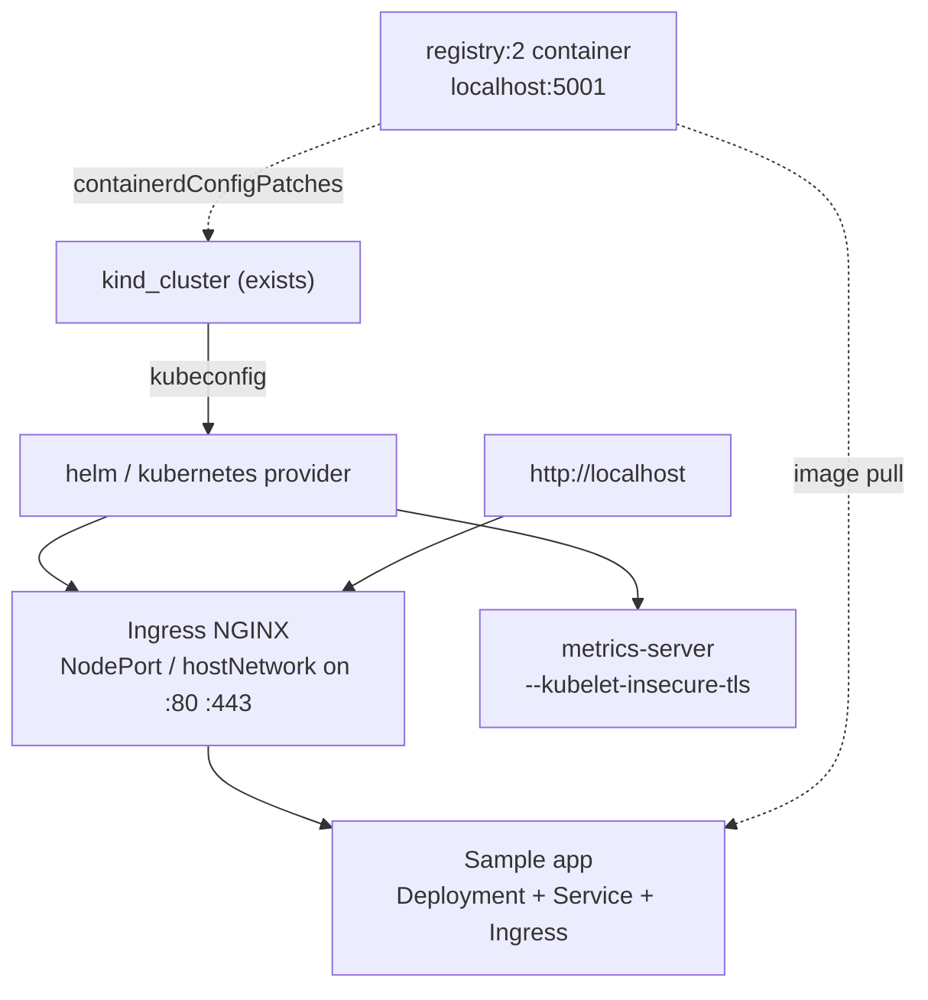
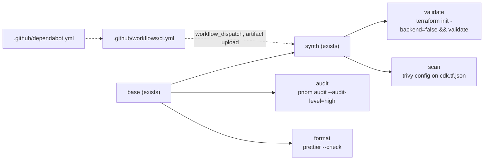

# TODO

Deferred add-ons for the local kind cluster. Each would be added as a new
construct in `infra/local-kind/main.ts`, most likely via the `hashicorp/helm`
or `hashicorp/kubernetes` CDKTF provider pointed at the kubeconfig the kind
cluster resource outputs.

- [ ] **Ingress NGINX**: install the `ingress-nginx` Helm chart with
      `hostNetwork` or a NodePort bound to the 80/443 port mappings already on
      the control-plane node, so services are reachable at `http://localhost`.
- [ ] **Metrics server**: install the `metrics-server` chart with
      `--kubelet-insecure-tls` (kind uses self-signed kubelet certs) to enable
      `kubectl top` and HorizontalPodAutoscaler practice.
- [ ] **Local container registry**: run a `registry:2` container on the kind
      Docker network and add a `containerdConfigPatches` entry so nodes can pull
      from `localhost:5001`. Useful for CI/CD without a remote registry.
- [ ] **Sample app**: a small Deployment + Service + Ingress (e.g. `httpbin` or
      a hello-world image) that proves the cluster and ingress work end to end.

## CI pipeline

Deferred additions to the Dagger module in `ci/src/index.ts`. Each is a new
`@func()` on the `Devops` class, wired into `ci` (which keeps running every
step and reporting all failures), with a matching Makefile target and a row in
`docs/ci.md`.

- [ ] **terraform validate**: run `terraform init -backend=false` and
      `terraform validate` on the synthesized `cdktf.out` stack. Terraform is
      already in the base image, so no new dependencies; catches broken HCL that
      `cdktf synth` alone does not.
- [ ] **pnpm audit + Trivy IaC scan**: `pnpm audit --audit-level=high` for
      known-vulnerable dependencies, and a `trivy config` scan (`aquasec/trivy`
      image) of the synthesized `cdk.tf.json` for misconfigurations.
- [ ] **Prettier format check**: `prettier --check` on `infra/local-kind`
      sources; adds `prettier` as a devDependency of the stack.
- [ ] **Workflow extras**: `workflow_dispatch` trigger, upload `cdktf.out` as a
      build artifact via `dagger call synth export` + `actions/upload-artifact`,
      and a `.github/dependabot.yml` covering GitHub Actions, `ci/` and
      `infra/local-kind`.

## AWS cluster

Deferred additions to `infra/aws-kind/`.

- [ ] **Add-ons on AWS**: the ingress, metrics-server and sample-app items above
      apply equally to `devops-aws`; the 80/443 port mappings are already in
      place. Install through the systemd unit's script or a helm/kubernetes
      provider pointed at the SSM tunnel.
- [ ] **CI coverage**: parameterise `STACK_DIR` in `ci/src/index.ts` so
      typecheck, test and synth also run for `infra/aws-kind` (synth needs a
      `STATE_BUCKET` env var; any string works for synth).
- [ ] **Shared topology**: `nodeTopology()` in `local-kind` and the YAML in
      `userData()` describe the same nodes twice. A small shared package that
      emits both would keep them from drifting.
- [ ] **Elastic IP + Route 53**: a stable address for the ingress ports; costs
      about USD 3.6/month while the instance is stopped.
- [ ] **Spot instance**: `instance_market_options { market_type = "spot" }` on
      the host would cut the hourly rate by roughly 60%, at the risk of the
      session being interrupted.
