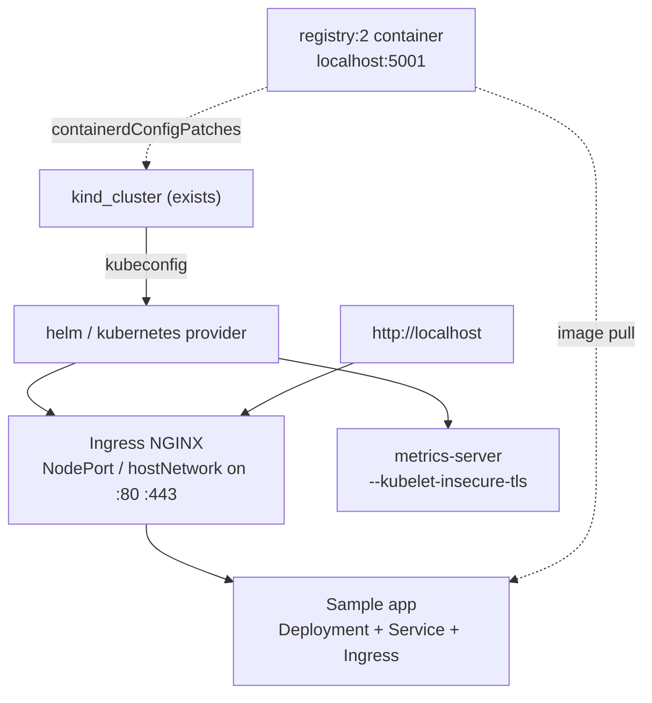

# TODO

Deferred add-ons for the local kind cluster. Each would be added as a new
construct in `infra/local-kind/main.ts`, most likely via the `hashicorp/helm`
or `hashicorp/kubernetes` CDKTF provider pointed at the kubeconfig the kind
cluster resource outputs.

- [ ] **Ingress NGINX**: install the `ingress-nginx` Helm chart with
      `hostNetwork` or a NodePort bound to the 80/443 port mappings already on
      the control-plane node, so services are reachable at `http://localhost`.
- [ ] **Metrics server**: install the `metrics-server` chart with
      `--kubelet-insecure-tls` (kind uses self-signed kubelet certs) to enable
      `kubectl top` and HorizontalPodAutoscaler practice.
- [ ] **Local container registry**: run a `registry:2` container on the kind
      Docker network and add a `containerdConfigPatches` entry so nodes can pull
      from `localhost:5001`. Useful for CI/CD without a remote registry.
- [ ] **Sample app**: a small Deployment + Service + Ingress (e.g. `httpbin` or
      a hello-world image) that proves the cluster and ingress work end to end.
