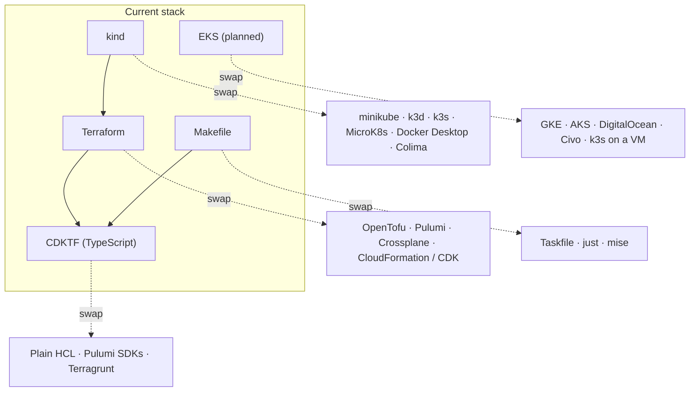

# Alternative tools

The repository currently uses kind, Terraform, CDK for Terraform (TypeScript),
Docker and a Makefile, with EKS as the planned cloud target. This page lists
the main alternatives at each layer so the choices can be revisited later.
Nothing here is planned; it is a reference for when a tool stops fitting.

## Local Kubernetes cluster (kind)

| Tool | How it differs from kind | When to pick it |
| --- | --- | --- |
| [minikube](https://minikube.sigs.k8s.io/) | Single node by default, many drivers (Docker, VM, bare metal), built-in addons (ingress, metrics-server, registry) | You want addons enabled with one flag instead of Helm charts |
| [k3d](https://k3d.io/) | Runs [k3s](https://k3s.io/) in Docker; lighter and faster to start than kind, built-in load balancer and registry | Faster iteration or lower RAM budget |
| [k3s](https://k3s.io/) | Lightweight single-binary distribution, runs directly on the host or a VM rather than in containers | Practising on a Raspberry Pi or a small cloud VM |
| [MicroK8s](https://microk8s.io/) | Snap-packaged distribution from Canonical with addon system | Ubuntu hosts, multi-node on real machines |
| Docker Desktop / Rancher Desktop / [Colima](https://github.com/abiosoft/colima) | Kubernetes bundled with the container runtime | You already run one of these and want zero extra tooling |
| [Talos](https://www.talos.dev/) in Docker | Immutable, API-managed OS; closer to production hardening | Learning Talos before using it on bare metal |

kind remains the best fit for reproducible multi-node clusters driven by IaC,
which is why it is used here. k3d is the closest drop-in alternative and also
has a Terraform provider (`pvotal-tech/k3d`).

## Infrastructure as code engine (Terraform)

| Tool | How it differs from Terraform | When to pick it |
| --- | --- | --- |
| [OpenTofu](https://opentofu.org/) | Open-source (MPL) fork of Terraform 1.5; same HCL and providers, adds state encryption | Licence concerns with HashiCorp BSL, otherwise a drop-in swap |
| [Pulumi](https://www.pulumi.com/) | Real programming languages with its own engine and state backend; no HCL layer underneath | You like CDKTF's TypeScript but not the extra synth step |
| [Crossplane](https://www.crossplane.io/) | Kubernetes controllers reconcile cloud resources continuously from CRDs | GitOps-first setups where the cluster is the control plane |
| AWS CloudFormation / [AWS CDK](https://aws.amazon.com/cdk/) | AWS-native, no state file to manage, CDK gives TypeScript constructs | AWS-only work, especially EKS with `aws-eks` L2 constructs |
| [Ansible](https://www.ansible.com/) | Procedural configuration management rather than declarative state | Configuring VMs or bare-metal nodes, not cloud resources |

## IaC authoring layer (CDKTF)

| Tool | How it differs from CDKTF | When to pick it |
| --- | --- | --- |
| Plain HCL | No Node.js toolchain, no generated bindings, the format most tutorials use | Simplicity, or when Terraform docs and examples matter more than typing |
| [Terragrunt](https://terragrunt.gruntwork.io/) | Thin wrapper over HCL for DRY multi-environment layouts and remote state | Many environments or stacks that share config |
| [Pulumi](https://www.pulumi.com/) SDKs | TypeScript/Python/Go with unit-testable resources and no JSON synth step | See above; replaces both Terraform and CDKTF |
| CDKTF in Python or Go | Same tool, different language | The team is more fluent in Python or Go than TypeScript |

Dropping Terraform (for Pulumi or CloudFormation) also drops CDKTF. Dropping
CDKTF alone (for plain HCL) keeps every provider and the state file.

## Cluster add-ons (planned, see `docs/TODO.md`)

| Layer | Current plan | Alternatives |
| --- | --- | --- |
| Ingress | Ingress NGINX | [Traefik](https://traefik.io/), [Contour](https://projectcontour.io/), [HAProxy Ingress](https://haproxy-ingress.github.io/), Envoy Gateway or Cilium Gateway for the newer Gateway API |
| Metrics | metrics-server | kube-prometheus-stack (Prometheus + Grafana) if you also want dashboards |
| Local registry | `registry:2` container | [Harbor](https://goharbor.io/), [Zot](https://zotregistry.dev/), `kind load docker-image` (no registry at all), ttl.sh for throwaway images |
| Package install | Helm via CDKTF provider | [Kustomize](https://kustomize.io/), [Argo CD](https://argo-cd.readthedocs.io/) or [Flux](https://fluxcd.io/) (GitOps), [Timoni](https://timoni.sh/) |
| Networking | kindnet (default) | [Cilium](https://cilium.io/) or [Calico](https://www.tigera.io/project-calico/) for NetworkPolicy practice |
| Dev loop | manual `kubectl apply` | [Tilt](https://tilt.dev/), [Skaffold](https://skaffold.dev/), [DevSpace](https://www.devspace.sh/) |

## Task runner (Makefile)

| Tool | How it differs from make | When to pick it |
| --- | --- | --- |
| [Taskfile](https://taskfile.dev/) | YAML task definitions, cross-platform, no tab-vs-space traps | Windows contributors or many parameterised tasks |
| [just](https://github.com/casey/just) | make-like syntax without build semantics, arguments and `.env` support | You want make's feel with fewer sharp edges |
| [mise](https://mise.jdx.dev/) | Tool version manager plus tasks; can pin kind, terraform and node per project | Replacing the manual version table in `docs/local-cluster.md` |
| pnpm scripts | Already present in `infra/local-kind/package.json` | Keeping everything inside the Node toolchain |

## Cloud target (EKS, planned)

| Option | Notes |
| --- | --- |
| GKE (Google Cloud) | Autopilot mode bills per pod, often cheaper than EKS for small clusters; free control plane on one zonal cluster |
| AKS (Azure) | Free control plane, pay for nodes only |
| DigitalOcean / Civo / Linode LKE | Managed Kubernetes with flat, predictable pricing; good for keeping cost down |
| k3s on a single EC2 or Hetzner VM | Cheapest option; no managed control plane but the same IaC and add-on practice |
| [LocalStack](https://localstack.cloud/) | Emulates AWS APIs locally; EKS emulation is a paid feature, so of limited use here |

The EKS control plane alone costs around USD 73 per month, so for cost-driven
practice a cheaper provider or a self-managed k3s VM may be worth considering.

## CI/CD (planned)

| Tool | Notes |
| --- | --- |
| GitHub Actions | Default for a GitHub-hosted repo; `helm/kind-action` spins up kind in CI |
| GitLab CI | Built-in registry and Kubernetes agent |
| Argo CD / Flux | Pull-based GitOps deployment into the cluster instead of push from CI |
| [Dagger](https://dagger.io/) | Pipelines as code (TypeScript, Python, Go) that run the same locally and in CI |
| [act](https://github.com/nektos/act) | Runs GitHub Actions locally in Docker for fast pipeline iteration |
