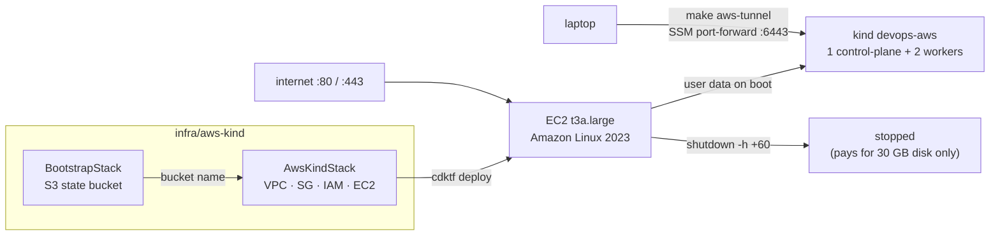
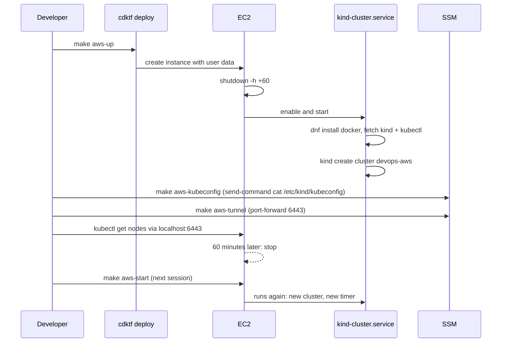

# AWS Kubernetes cluster

The AWS cluster is the same kind cluster as the local one, running on a single
EC2 instance in `ap-southeast-1`. The instance installs Docker and kind on
boot, creates the cluster, and **stops itself after 60 minutes** so it cannot
run up a bill by accident. The code lives in `infra/aws-kind/` and uses the
`hashicorp/aws` CDKTF provider with Terraform state in S3.

EKS was deliberately not used: its control plane alone costs about USD 73 per
month, and kind is what the rest of the repo already practises against. See
`docs/alternatives.md` for the trade-offs.



## Prerequisites

Everything in `docs/local-cluster.md` plus:

| Tool | Notes |
| --- | --- |
| AWS CLI v2 | Credentials for an account where you can create VPC, EC2, IAM and S3 resources |
| [Session Manager plugin](https://docs.aws.amazon.com/systems-manager/latest/userguide/session-manager-working-with-install-plugin.html) | Needed by `make aws-tunnel` |
| Terraform >= 1.10 | For S3-native state locking (`use_lockfile`) |

## How it works

1. `BootstrapStack` (`aws-bootstrap`) creates one versioned, encrypted,
   non-public S3 bucket named `devops-tfstate-<account-id>`. Its own state is
   local and git-ignored; this stack is applied once per account.
2. `AwsKindStack` (`aws-kind`) stores state in that bucket and creates:
   - a VPC with one public subnet, internet gateway and default route;
   - a security group that allows inbound 80 and 443 only. No port 22 and no
     6443: SSH is replaced by SSM Session Manager, and the API server is only
     reachable through an SSM port-forward;
   - an IAM role with `AmazonSSMManagedInstanceCore` and an instance profile;
   - one `t3a.large` (2 vCPU, 8 GB) Amazon Linux 2023 instance with a 30 GB
     gp3 root volume, IMDSv2 required, and `instance_initiated_shutdown_behavior = stop`.
3. The instance's user data (`userData()` in `main.ts`) runs on first boot. Its
   first line is `shutdown -h +60`, so the stop is scheduled before anything
   can fail. It then installs a systemd oneshot unit, `kind-cluster.service`,
   that installs Docker, kind and kubectl, writes a kind config with the same
   topology as the local cluster, creates cluster `devops-aws`, and saves the
   kubeconfig to `/etc/kind/kubeconfig`. The unit reschedules the stop on every
   boot, so `make aws-start` after an auto-stop gives you a fresh cluster and a
   fresh hour.
4. Because the shutdown behaviour is *stop* rather than *terminate*, Terraform
   state stays accurate and the only cost while stopped is the EBS volume.



## Usage

```sh
make aws-install     # once: pnpm install + cdktf get (the AWS provider is large)
make aws-test        # Jest tests on the synthesized Terraform
make aws-bootstrap   # once per account: create the S3 state bucket
make aws-up          # create the host; the cluster is ready ~4 minutes later
make aws-kubeconfig  # pull the kubeconfig to infra/aws-kind/kubeconfig
make aws-tunnel      # in a second terminal, keep running
make aws-status      # kubectl get nodes through the tunnel
make aws-stop        # stop early instead of waiting for the timer
make aws-start       # boot again for another hour (new cluster)
make aws-down        # destroy the host and network; the state bucket stays
```

Variables you can override on the command line:

| Variable | Default | Effect |
| --- | --- | --- |
| `LIFETIME_MINUTES` | 60 | `make aws-up LIFETIME_MINUTES=120` gives a two-hour timer. Changing it replaces the instance because the value lives in user data. |
| `STATE_BUCKET` | `devops-tfstate-<account-id>` | Use a different state bucket |
| `AWS_REGION` | `ap-southeast-1` | Only affects the `aws` CLI calls in the Makefile; the stack region is fixed in `main.ts` |

The kubeconfig points at `https://127.0.0.1:6443`, which is exactly where the
SSM tunnel lands, so no certificate or server rewriting is needed. To use it
directly:

```sh
export KUBECONFIG=$(pwd)/infra/aws-kind/kubeconfig
kubectl get nodes
```

To get a shell on the host, use SSM instead of SSH:

```sh
aws ssm start-session --region ap-southeast-1 --target <instance-id>
sudo journalctl -u kind-cluster.service   # boot progress
```

## Cost

On-demand prices in `ap-southeast-1`, approximate:

| Item | Cost |
| --- | --- |
| `t3a.large` while running | USD 0.08 per hour |
| 30 GB gp3 root volume while stopped | USD 2.9 per month |
| S3 state bucket | a few cents per month |

One hour of practice per day is roughly USD 5 per month. `make aws-down`
removes the volume as well.

## Reaching the ingress ports

Ports 80 and 443 on the instance's public IP (the `public_ip` output) map to
the control-plane node, the same as `localhost:80/443` on the local cluster.
Nothing listens there until an ingress controller is installed; see
`docs/TODO.md`. The public IP changes on every stop/start because there is no
Elastic IP.
