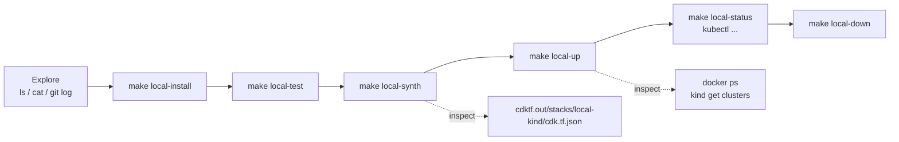

# Terminal commands cheat sheet

Commands for exploring and operating this repository from the terminal. Run
them from the repository root unless a `cd` is shown. `make help` is always the
quickest starting point.



## Orientation

| Command | What it shows |
| --- | --- |
| `make help` | Every Makefile target with its one-line description |
| `ls -la` | Top-level layout: `infra/`, `docs/`, `Makefile`, `AGENTS.md` (`CLAUDE.md` is a symlink to it) |
| `cat README.md` | Project purpose and the local-cluster overview |
| `cat AGENTS.md` | Rules for AI coding agents, including the commit-message policy |
| `cat docs/local-cluster.md` | How the kind cluster is built, prerequisites, usage |
| `cat docs/TODO.md` | Planned add-ons (ingress, metrics-server, registry, sample app) |
| `git log --oneline` | Commit history |
| `git status` | Working-tree state |

## Tool versions

Check the prerequisites listed in `docs/local-cluster.md` are installed.

```sh
docker --version
kind version
kubectl version --client
terraform version
node --version
pnpm --version
```

## Infrastructure code (`infra/local-kind/`)

| Command | What it shows |
| --- | --- |
| `cat infra/local-kind/main.ts` | The `KindClusterStack` and `nodeTopology()` definitions |
| `cat infra/local-kind/cdktf.json` | CDKTF settings: app command, project id, providers (`tehcyx/kind`) |
| `cat infra/local-kind/package.json` | pnpm scripts and dependency versions |
| `cat infra/local-kind/__tests__/main.test.ts` | Jest tests that assert on the synthesized Terraform |
| `ls infra/local-kind/.gen/providers/kind` | Generated TypeScript bindings for the kind provider (after `make local-install`) |
| `cat infra/local-kind/.gitignore` | What is deliberately not committed (`cdktf.out/`, `.gen/`, state, `node_modules/`) |

## Makefile targets

These wrap the pnpm and cdktf commands so you rarely need to `cd` into
`infra/local-kind/`.

```sh
make local-install   # pnpm install + cdktf get (fetch provider bindings)
make local-test      # jest
make local-synth     # cdktf synth -> cdktf.out/
make local-up        # cdktf deploy --auto-approve
make local-status    # kubectl get nodes -o wide with the generated kubeconfig
make local-down      # cdktf destroy --auto-approve
```

Equivalent raw commands, for when you want to pass extra flags:

```sh
cd infra/local-kind
pnpm install
pnpm exec cdktf get
pnpm test
pnpm exec cdktf synth
pnpm exec cdktf diff          # plan without applying
pnpm exec cdktf deploy        # interactive approval
pnpm exec cdktf output        # show kubeconfig_path and endpoint outputs
pnpm exec cdktf destroy
```

## Inspecting synthesized output

Run `make local-synth` first.

```sh
ls infra/local-kind/cdktf.out/stacks/local-kind/
cat infra/local-kind/cdktf.out/stacks/local-kind/cdk.tf.json | jq .
cat infra/local-kind/cdktf.out/stacks/local-kind/cdk.tf.json | jq '.resource.kind_cluster'
```

Terraform state lives next to the code. Never edit it by hand.

```sh
cd infra/local-kind
terraform -chdir=cdktf.out/stacks/local-kind show    # human-readable state
terraform -chdir=cdktf.out/stacks/local-kind state list
```

## Working with the running cluster

The provider writes a standalone kubeconfig. Either export it once or pass
`--kubeconfig` each time.

```sh
export KUBECONFIG=$(pwd)/infra/local-kind/cdktf.out/stacks/local-kind/devops-local-config
```

| Command | What it shows |
| --- | --- |
| `kind get clusters` | Should list `devops-local` |
| `kind get nodes --name devops-local` | The three node containers |
| `docker ps --filter name=devops-local` | The same nodes as Docker containers |
| `kubectl get nodes -o wide` | Node roles, versions, internal IPs |
| `kubectl get nodes --show-labels` | Confirms `ingress-ready=true` on the control plane |
| `kubectl get pods -A` | All system pods (CoreDNS, kindnet, kube-proxy, etc.) |
| `kubectl cluster-info` | API server and CoreDNS endpoints |
| `kubectl describe node devops-local-control-plane` | Capacity, taints, conditions |
| `docker port devops-local-control-plane` | Verifies the 80/443 host port mappings |
| `docker exec -it devops-local-control-plane crictl images` | Images cached on a node |
| `kubectl top nodes` | Only works once metrics-server from `docs/TODO.md` is installed |

## Troubleshooting

```sh
docker info                                   # is the daemon running?
kind export logs --name devops-local ./kind-logs
kubectl get events -A --sort-by=.lastTimestamp
kind delete cluster --name devops-local       # last resort if terraform state is out of sync
```

If you delete the cluster with `kind` directly, Terraform still believes it
exists. Run `make local-down` afterwards (it will fail harmlessly) or remove the
resource from state with `terraform -chdir=cdktf.out/stacks/local-kind state rm kind_cluster.cluster`
before the next `make local-up`.
