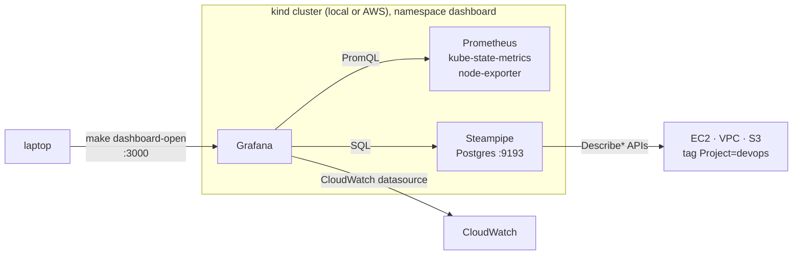

# In-cluster dashboard

Grafana runs inside the kind cluster and shows two things side by side: the
cluster's own Kubernetes resources, and the AWS resources this repository
creates. The same stack, `infra/dashboard/`, installs on `devops-local` and
`devops-aws`. It is reached only with `kubectl port-forward`.



## What it shows

| Dashboard | Source | Content |
| --- | --- | --- |
| Kubernetes / Compute Resources / *, Nodes, Pods, Namespaces | kube-prometheus-stack (bundled) | CPU, memory, network per node, namespace and pod |
| Node Exporter / Nodes | kube-prometheus-stack (bundled) | Host-level metrics of each kind node |
| AWS resources (Project=devops) | `infra/dashboard/dashboards/aws-resources.json` | EC2 host table and cost of the current run, CPU / network / status-check graphs from CloudWatch, VPC and subnet table, security-group rules, S3 bucket settings |

Steampipe turns AWS APIs into SQL tables (`aws_ec2_instance`, `aws_vpc`,
`aws_s3_bucket`, ...). Grafana queries it through its PostgreSQL datasource,
so adding a panel is a matter of writing a `select` filtered on
`tags ->> 'Project' = 'devops'`. Explore other tables with:

```sh
kubectl -n dashboard exec -it deploy/steampipe -- steampipe query "select name from aws_s3_bucket"
```

## AWS credentials

| Cluster | How pods authenticate to AWS |
| --- | --- |
| `devops-local` | `make dashboard-local-up` runs `aws configure export-credentials` and stores the keys in Secret `aws-credentials`. Re-run the target when temporary credentials expire. |
| `devops-aws` | The EC2 instance role. `infra/aws-kind` grants it read-only `ec2:Describe*`, `s3:GetBucket*`, `cloudwatch:GetMetric*` and friends, and sets the IMDSv2 hop limit to 3 so pods inside the kind node container can reach the metadata service. |

## Usage

```sh
make dashboard-install    # once: pnpm install + cdktf get
make dashboard-test       # Jest tests on the synthesized Terraform

make local-up             # if not already running
make dashboard-local-up   # ~3 minutes: Helm release + Steampipe
make dashboard-open       # http://localhost:3000, admin / admin

make aws-up && make aws-kubeconfig && make aws-tunnel   # AWS cluster, tunnel in its own terminal
make dashboard-aws-up
make dashboard-open TARGET=aws

make dashboard-local-down / dashboard-aws-down          # remove
```

Override the passwords with `TF_VAR_grafana_admin_password` and
`TF_VAR_steampipe_password` when deploying.

## Resource use

kube-prometheus-stack plus Steampipe use roughly 1.5 GB of memory. That is
fine on the `t3a.large`; locally, check that Docker's memory limit leaves that
much headroom for the three kind nodes.

## Troubleshooting

| Symptom | Cause and fix |
| --- | --- |
| AWS panels show `NoCredentialProviders` on the AWS cluster | The instance was created before the hop-limit change. `make aws-down && make aws-up` recreates it. |
| AWS panels show `ExpiredToken` locally | Temporary credentials expired; `make dashboard-local-up` again. |
| Steampipe panels show a connection error | The pod installs its plugin on start and takes about a minute to become ready: `kubectl -n dashboard get pods`. |
| Grafana shows no dashboards | `kubectl -n dashboard logs deploy/kube-prometheus-stack-grafana -c grafana-sc-dashboard`. |
