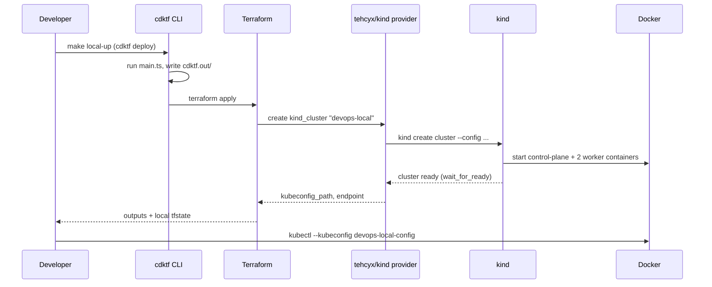

# Local Kubernetes cluster

The local cluster is a [kind](https://kind.sigs.k8s.io/) cluster defined in
TypeScript with [CDK for Terraform](https://developer.hashicorp.com/terraform/cdktf)
and the [`tehcyx/kind`](https://registry.terraform.io/providers/tehcyx/kind)
provider. The code lives in `infra/local-kind/`.

## Prerequisites

| Tool | Tested version |
| --- | --- |
| Docker | 29.x |
| kind | 0.32 |
| kubectl | any recent |
| Terraform | 1.14 |
| Node.js | 26 |
| pnpm | 10 |

The `cdktf` CLI is a dev dependency of the project, so it does not need to be
installed globally.

## How it works

1. `main.ts` declares a `KindClusterStack` containing one `kind_cluster`
   resource. Node topology comes from `nodeTopology()`.
2. `cdktf synth` runs `main.ts` and writes Terraform JSON to `cdktf.out/`.
3. `cdktf deploy` runs `terraform apply` on that JSON. The kind provider shells
   out to kind, which starts one Docker container per node.
4. The provider writes a standalone kubeconfig to
   `infra/local-kind/cdktf.out/stacks/local-kind/devops-local-config` (also
   printed as the `kubeconfig_path` output). Either pass it with
   `--kubeconfig` or export `KUBECONFIG=$(pwd)/infra/local-kind/cdktf.out/stacks/local-kind/devops-local-config`.



## Usage

```sh
make local-install   # once: pnpm install + cdktf get
make local-test      # Jest tests on the synthesized Terraform
make local-up        # create the cluster
make local-status    # kubectl get nodes using the generated kubeconfig
make local-down      # destroy the cluster
```

Terraform state is stored locally in `infra/local-kind/terraform.*.tfstate`
and is git-ignored. If state is lost, `kind delete cluster --name devops-local`
removes the cluster manually.

## Add-ons

None are installed yet. See `docs/TODO.md`.
