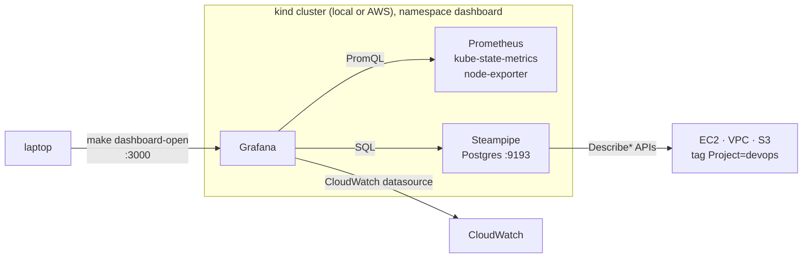

# In-cluster Grafana + Steampipe Dashboard Implementation Plan

> **For agentic workers:** REQUIRED SUB-SKILL: Use superpowers:subagent-driven-development (recommended) or superpowers:executing-plans to implement this plan task-by-task. Steps use checkbox (`- [ ]`) syntax for tracking.

**Goal:** A Grafana dashboard running inside either kind cluster that shows the cluster's Kubernetes resources and the AWS resources this repo creates.

**Architecture:** A new CDKTF stack `infra/dashboard/` installs kube-prometheus-stack (Prometheus, kube-state-metrics, node-exporter, Grafana) by Helm, plus a Steampipe Deployment that exposes AWS APIs as Postgres tables. Grafana reads Kubernetes data from Prometheus, AWS metrics from its CloudWatch datasource, and AWS inventory from Steampipe via the PostgreSQL datasource. The stack is instantiated twice (`dashboard-local`, `dashboard-aws`); locally AWS credentials come from a Secret filled from the AWS CLI, on AWS from the instance role.

**Tech Stack:** CDKTF 0.21 (TypeScript), `hashicorp/helm@~> 3.0`, `hashicorp/kubernetes@~> 3.0`, kube-prometheus-stack chart 89.2.2, `turbot/steampipe:0.22.0`, Jest, Dagger CI.

**Spec:** `docs/superpowers/specs/2026-09-06-dashboard-design.md`

## Global Constraints

- Commit messages: conventional subject, imperative, < 72 chars, **no** `Co-Authored-By`, `Claude-Session`, session URLs or tool attribution (see `CLAUDE.md`).
- Same toolchain as `infra/aws-kind`: pnpm, ts-node, jest, `tsconfig.json` copied verbatim.
- Region is `ap-southeast-1`; AWS resources are filtered on tag `Project=devops`.
- Access is `kubectl port-forward` only. No Ingress, no public exposure.
- All dashboard resources live in namespace `dashboard`.
- Pin versions: chart `89.2.2`, Steampipe image `0.22.0`.
- Deviations from the spec, agreed here: kubernetes provider `~> 3.0` (3.x is current); IMDS hop limit **3** not 2 (host → kind node container → pod is two routed hops); Steampipe installs its plugin in the main container's command instead of an init container (the image's bundled database would be hidden by an emptyDir); the cost stat shows the **current run** (since `launch_time`), because that is the only start time the EC2 API exposes.
- Run `make aws-test`, `make dashboard-test` and `make ci` before claiming any task done.

---

### Task 1: Give the AWS host read-only access and make IMDS reachable from pods

**Files:**
- Modify: `infra/aws-kind/main.ts` (after the `IamRolePolicyAttachment` block around line 232, and the `metadataOptions` line around line 254)
- Test: `infra/aws-kind/__tests__/main.test.ts`

**Interfaces:**
- Produces: exported `DASHBOARD_READ_ACTIONS: string[]` from `infra/aws-kind/main.ts`; an `aws_iam_role_policy` resource named `dashboard_read`; `metadata_options.http_put_response_hop_limit = 3`.

- [ ] **Step 1: Write the failing tests**

Add inside `describe("AwsKindStack", ...)` in `infra/aws-kind/__tests__/main.test.ts`, after the SSM test:

```ts
  it("lets pods reach IMDSv2 through the kind node container", () => {
    expect(instance.metadata_options.http_put_response_hop_limit).toBe(3);
  });

  it("grants the dashboard read-only access to EC2, S3 and CloudWatch", () => {
    const policy = firstResource(parsed, "aws_iam_role_policy");
    const doc = JSON.parse(policy.policy);
    expect(doc.Statement).toHaveLength(1);
    expect(doc.Statement[0].Effect).toBe("Allow");
    expect(doc.Statement[0].Action).toEqual(DASHBOARD_READ_ACTIONS);
    for (const action of DASHBOARD_READ_ACTIONS) {
      expect(action).toMatch(/^(ec2:Describe\*|s3:(ListAllMyBuckets|GetBucket\*)|cloudwatch:(GetMetricData|ListMetrics|GetMetricStatistics)|tag:GetResources|sts:GetCallerIdentity)$/);
    }
  });
```

Extend the import at the top of the test file:

```ts
import {
  AwsKindStack,
  BootstrapStack,
  CLUSTER_NAME,
  DASHBOARD_READ_ACTIONS,
  INSTANCE_TYPE,
  REGION,
  userData,
} from "../main";
```

- [ ] **Step 2: Run the tests to verify they fail**

Run: `make aws-test`
Expected: FAIL, `DASHBOARD_READ_ACTIONS` is not exported and `http_put_response_hop_limit` is undefined.

- [ ] **Step 3: Implement**

In `infra/aws-kind/main.ts` add the import next to the other IAM imports:

```ts
import { IamRolePolicy } from "./.gen/providers/aws/iam-role-policy";
```

Add the constant after `SSM_CORE_POLICY`:

```ts
/**
 * Read-only actions the in-cluster dashboard (Grafana CloudWatch datasource
 * and Steampipe) needs. Scoped by hand instead of `ReadOnlyAccess` so the host
 * cannot read anything the dashboard does not show.
 */
export const DASHBOARD_READ_ACTIONS = [
  "ec2:Describe*",
  "s3:ListAllMyBuckets",
  "s3:GetBucket*",
  "cloudwatch:GetMetricData",
  "cloudwatch:ListMetrics",
  "cloudwatch:GetMetricStatistics",
  "tag:GetResources",
  "sts:GetCallerIdentity",
];
```

After the `IamRolePolicyAttachment` `role_ssm` block, add:

```ts
    new IamRolePolicy(this, "dashboard_read", {
      name: `${CLUSTER_NAME}-dashboard-read`,
      role: role.id,
      policy: JSON.stringify({
        Version: "2012-10-17",
        Statement: [{ Effect: "Allow", Action: DASHBOARD_READ_ACTIONS, Resource: "*" }],
      }),
    });
```

Change the `metadataOptions` line on the `Instance` to:

```ts
      // Pods run inside a kind node container inside Docker: two routed hops
      // from the host, so the default hop limit of 1 blocks IMDS for them.
      metadataOptions: { httpTokens: "required", httpEndpoint: "enabled", httpPutResponseHopLimit: 3 },
```

- [ ] **Step 4: Run the tests to verify they pass**

Run: `make aws-test`
Expected: PASS, including "produces valid Terraform".

- [ ] **Step 5: Commit**

```bash
git add infra/aws-kind/main.ts infra/aws-kind/__tests__/main.test.ts
git commit -m "feat: grant the AWS host read-only access for the dashboard"
```

---

### Task 2: Scaffold `infra/dashboard` with the Helm release

**Files:**
- Create: `infra/dashboard/package.json`, `infra/dashboard/cdktf.json`, `infra/dashboard/tsconfig.json`, `infra/dashboard/jest.config.js`, `infra/dashboard/jest.setup.js`, `infra/dashboard/main.ts`
- Test: `infra/dashboard/__tests__/main.test.ts`
- Modify: `Makefile` (add `DASH_DIR` and install/test/synth targets; `.PHONY` line)

**Interfaces:**
- Produces: `DashboardStack` class with `DashboardStackProps { kubeconfigPath: string; awsCredentials: "secret" | "instance-role" }`; exported constants `NAMESPACE = "dashboard"`, `CHART_VERSION = "89.2.2"`, `RELEASE_NAME = "kube-prometheus-stack"`, `REGION = "ap-southeast-1"`; exported `grafanaValues(props): object` returning the Helm values object (later tasks extend it). The Helm release's `values[0]` is `JSON.stringify(grafanaValues(props))`.

- [ ] **Step 1: Create the project files**

`infra/dashboard/package.json`:

```json
{
  "name": "dashboard",
  "version": "0.1.0",
  "private": true,
  "packageManager": "pnpm@10.34.5",
  "description": "Grafana + Steampipe dashboard for the kind clusters, defined with CDK for Terraform",
  "main": "main.js",
  "scripts": {
    "get": "cdktf get",
    "build": "tsc",
    "synth": "cdktf synth",
    "test": "jest"
  },
  "devDependencies": {
    "@types/jest": "^30.0.0",
    "@types/node": "^26.4.1",
    "cdktf-cli": "^0.21.0",
    "jest": "^30.5.1",
    "ts-jest": "^29.4.12",
    "ts-node": "^10.9.2",
    "typescript": "^6.0.3"
  },
  "dependencies": {
    "cdktf": "^0.21.0",
    "constructs": "^10.8.1"
  },
  "pnpm": {
    "onlyBuiltDependencies": [
      "@cdktf/node-pty-prebuilt-multiarch",
      "@parcel/watcher",
      "unrs-resolver"
    ]
  }
}
```

`infra/dashboard/cdktf.json`:

```json
{
  "language": "typescript",
  "app": "pnpm exec ts-node main.ts",
  "projectId": "devops-dashboard",
  "sendCrashReports": "false",
  "terraformProviders": ["hashicorp/helm@~> 3.0", "hashicorp/kubernetes@~> 3.0"],
  "terraformModules": [],
  "context": {}
}
```

Copy `infra/aws-kind/tsconfig.json`, `infra/aws-kind/jest.config.js` and `infra/aws-kind/jest.setup.js` unchanged:

```bash
cp infra/aws-kind/tsconfig.json infra/aws-kind/jest.config.js infra/aws-kind/jest.setup.js infra/dashboard/
```

- [ ] **Step 2: Add the Makefile targets and install**

In `Makefile`, after the `KUBECONFIG_AWS` line add:

```make
DASH_DIR := infra/dashboard
```

Add to `.PHONY`: `dashboard-install dashboard-test dashboard-synth`. After the `aws-status` target add:

```make
dashboard-install: ## Install deps and fetch CDKTF providers for the dashboard stack
	cd $(DASH_DIR) && pnpm install && pnpm exec cdktf get

dashboard-test: ## Run the dashboard stack unit tests
	cd $(DASH_DIR) && pnpm test

dashboard-synth: ## Synthesize Terraform config for both dashboard stacks
	cd $(DASH_DIR) && pnpm exec cdktf synth
```

Run: `make dashboard-install`
Expected: `.gen/providers/helm` and `.gen/providers/kubernetes` exist under `infra/dashboard/`.

- [ ] **Step 3: Write the failing test**

`infra/dashboard/__tests__/main.test.ts`:

```ts
import "cdktf/lib/testing/adapters/jest";
import { Testing } from "cdktf";
import {
  CHART_VERSION,
  DashboardStack,
  NAMESPACE,
  RELEASE_NAME,
} from "../main";

const KUBECONFIG = "/tmp/test-kubeconfig";

export function firstResource(parsed: any, type: string): any {
  return Object.values(parsed.resource[type])[0];
}

export function synthLocal() {
  const app = Testing.app();
  const stack = new DashboardStack(app, "dashboard-test-local", {
    kubeconfigPath: KUBECONFIG,
    awsCredentials: "secret",
  });
  return { stack, parsed: JSON.parse(Testing.synth(stack)) };
}

export function synthAws() {
  const app = Testing.app();
  const stack = new DashboardStack(app, "dashboard-test-aws", {
    kubeconfigPath: KUBECONFIG,
    awsCredentials: "instance-role",
  });
  return { stack, parsed: JSON.parse(Testing.synth(stack)) };
}

describe("DashboardStack providers and namespace", () => {
  const { stack, parsed } = synthLocal();

  it("points both providers at the given kubeconfig", () => {
    expect(Object.values(parsed.provider.kubernetes)[0]).toMatchObject({ config_path: KUBECONFIG });
    expect(Object.values(parsed.provider.helm)[0]).toMatchObject({
      kubernetes: { config_path: KUBECONFIG },
    });
  });

  it("creates the dashboard namespace", () => {
    expect(firstResource(parsed, "kubernetes_namespace_v1").metadata.name).toBe(NAMESPACE);
  });

  it("produces valid Terraform", () => {
    expect(Testing.fullSynth(stack)).toBeValidTerraform();
  });
});

describe("kube-prometheus-stack release", () => {
  const { parsed } = synthLocal();
  const release = firstResource(parsed, "helm_release");
  const values = JSON.parse(release.values[0]);

  it("installs the pinned chart into the dashboard namespace", () => {
    expect(release).toMatchObject({
      name: RELEASE_NAME,
      chart: "kube-prometheus-stack",
      repository: "https://prometheus-community.github.io/helm-charts",
      version: CHART_VERSION,
      namespace: NAMESPACE,
    });
  });

  it("disables alertmanager and keeps Prometheus retention short", () => {
    expect(values.alertmanager.enabled).toBe(false);
    expect(values.prometheus.prometheusSpec.retention).toBe("2h");
  });

  it("loads dashboards from labelled ConfigMaps", () => {
    expect(values.grafana.sidecar.dashboards.enabled).toBe(true);
    expect(values.grafana.sidecar.dashboards.label).toBe("grafana_dashboard");
  });

  it("takes the Grafana admin password from a variable", () => {
    expect(parsed.variable.grafana_admin_password.default).toBe("admin");
    expect(values.grafana.adminPassword).toBe("${var.grafana_admin_password}");
  });
});
```

- [ ] **Step 4: Run the test to verify it fails**

Run: `make dashboard-test`
Expected: FAIL, cannot find module `../main`.

- [ ] **Step 5: Write `infra/dashboard/main.ts`**

```ts
import * as path from "node:path";
import { App, TerraformOutput, TerraformStack, TerraformVariable } from "cdktf";
import { Construct } from "constructs";
import { HelmProvider } from "./.gen/providers/helm/provider";
import { Release } from "./.gen/providers/helm/release";
import { KubernetesProvider } from "./.gen/providers/kubernetes/provider";
import { NamespaceV1 } from "./.gen/providers/kubernetes/namespace-v1";

export const REGION = "ap-southeast-1";
export const NAMESPACE = "dashboard";
export const RELEASE_NAME = "kube-prometheus-stack";
export const CHART_VERSION = "89.2.2";
const CHART_REPO = "https://prometheus-community.github.io/helm-charts";

/** Where the two cluster stacks leave their kubeconfigs, relative to this file. */
export const KUBECONFIG_LOCAL = path.resolve(
  __dirname,
  "../local-kind/cdktf.out/stacks/local-kind/devops-local-config",
);
export const KUBECONFIG_AWS = path.resolve(__dirname, "../aws-kind/kubeconfig");

export interface DashboardStackProps {
  /** Kubeconfig both providers use to reach the cluster. */
  readonly kubeconfigPath: string;
  /**
   * `secret`: AWS keys are copied into a Secret (local cluster).
   * `instance-role`: pods use the EC2 instance role through IMDS (AWS cluster).
   */
  readonly awsCredentials: "secret" | "instance-role";
}

/** Helm values for kube-prometheus-stack. Kept as a function so tests can inspect it. */
export function grafanaValues(props: DashboardStackProps, adminPassword: string): object {
  return {
    alertmanager: { enabled: false },
    prometheus: {
      prometheusSpec: {
        retention: "2h",
        // kind has no persistent volumes worth keeping; an emptyDir is enough.
        storageSpec: { emptyDir: { sizeLimit: "1Gi" } },
      },
    },
    grafana: {
      adminPassword,
      sidecar: { dashboards: { enabled: true, label: "grafana_dashboard", labelValue: "1" } },
    },
  };
}

export class DashboardStack extends TerraformStack {
  constructor(scope: Construct, id: string, props: DashboardStackProps) {
    super(scope, id);

    new KubernetesProvider(this, "kubernetes", { configPath: props.kubeconfigPath });
    new HelmProvider(this, "helm", { kubernetes: { configPath: props.kubeconfigPath } });

    const adminPassword = new TerraformVariable(this, "grafana_admin_password", {
      type: "string",
      default: "admin",
      sensitive: true,
      description: "Grafana admin password; the UI is only reachable via port-forward",
    });

    const ns = new NamespaceV1(this, "namespace", { metadata: { name: NAMESPACE } });

    new Release(this, "kube_prometheus_stack", {
      name: RELEASE_NAME,
      repository: CHART_REPO,
      chart: "kube-prometheus-stack",
      version: CHART_VERSION,
      namespace: ns.metadata.name,
      values: [JSON.stringify(grafanaValues(props, adminPassword.stringValue))],
      wait: true,
      timeout: 900,
    });

    new TerraformOutput(this, "grafana_service", {
      value: `${RELEASE_NAME}-grafana.${NAMESPACE}.svc`,
      description: "Grafana Service; reach it with make dashboard-open",
    });
  }
}

// Only synthesize when run directly by `cdktf synth`, not when imported by tests.
if (require.main === module) {
  const app = new App();
  new DashboardStack(app, "dashboard-local", {
    kubeconfigPath: KUBECONFIG_LOCAL,
    awsCredentials: "secret",
  });
  new DashboardStack(app, "dashboard-aws", {
    kubeconfigPath: KUBECONFIG_AWS,
    awsCredentials: "instance-role",
  });
  app.synth();
}
```

- [ ] **Step 6: Run the tests to verify they pass**

Run: `make dashboard-test`
Expected: PASS (the `toBeValidTerraform` test downloads the two providers on first run).

Run: `make dashboard-synth`
Expected: `infra/dashboard/cdktf.out/stacks/dashboard-local/cdk.tf.json` and `.../dashboard-aws/cdk.tf.json` exist.

- [ ] **Step 7: Commit**

```bash
git add infra/dashboard Makefile
git commit -m "feat: add dashboard stack installing kube-prometheus-stack"
```

---

### Task 3: AWS credentials Secret and Grafana datasources

**Files:**
- Modify: `infra/dashboard/main.ts`
- Test: `infra/dashboard/__tests__/main.test.ts`

**Interfaces:**
- Consumes: `grafanaValues(props, adminPassword)` and `DashboardStack` from Task 2.
- Produces: `grafanaValues(props, adminPassword)` now also emits `envFromSecrets` and `additionalDataSources`; exported `AWS_SECRET_NAME = "aws-credentials"` and `STEAMPIPE_SECRET_NAME = "steampipe-db"`; Terraform variables `aws_access_key_id`, `aws_secret_access_key`, `aws_session_token` (local stack only) and `steampipe_password` (both); Grafana datasources with uids `cloudwatch` and `steampipe`. Task 4 must create the `steampipe-db` Secret with key `STEAMPIPE_DATABASE_PASSWORD`; this task creates it, Task 4 reads it.

- [ ] **Step 1: Write the failing tests**

Append to `infra/dashboard/__tests__/main.test.ts`:

```ts
describe("AWS credentials", () => {
  it("copies the CLI keys into a Secret on the local cluster", () => {
    const { parsed } = synthLocal();
    const secret = Object.values(parsed.resource.kubernetes_secret_v1 as any).find(
      (s: any) => s.metadata.name === AWS_SECRET_NAME,
    ) as any;
    expect(secret.metadata.namespace).toBe(NAMESPACE);
    expect(secret.data).toEqual({
      AWS_ACCESS_KEY_ID: "${var.aws_access_key_id}",
      AWS_SECRET_ACCESS_KEY: "${var.aws_secret_access_key}",
      AWS_SESSION_TOKEN: "${var.aws_session_token}",
    });
    expect(parsed.variable.aws_access_key_id.sensitive).toBe(true);
    expect(parsed.variable.aws_session_token.default).toBe("");
    const values = JSON.parse(firstResource(parsed, "helm_release").values[0]);
    expect(values.grafana.envFromSecrets.map((s: any) => s.name)).toEqual([
      STEAMPIPE_SECRET_NAME,
      AWS_SECRET_NAME,
    ]);
  });

  it("relies on the instance role on the AWS cluster", () => {
    const { parsed } = synthAws();
    const names = Object.values(parsed.resource.kubernetes_secret_v1 as any).map(
      (s: any) => s.metadata.name,
    );
    expect(names).not.toContain(AWS_SECRET_NAME);
    expect(parsed.variable.aws_access_key_id).toBeUndefined();
    const values = JSON.parse(firstResource(parsed, "helm_release").values[0]);
    expect(values.grafana.envFromSecrets.map((s: any) => s.name)).toEqual([STEAMPIPE_SECRET_NAME]);
  });
});

describe("Grafana datasources", () => {
  const { parsed } = synthLocal();
  const values = JSON.parse(firstResource(parsed, "helm_release").values[0]);
  const sources = values.grafana.additionalDataSources as any[];

  it("adds CloudWatch using the default credential chain", () => {
    const cw = sources.find((s) => s.uid === "cloudwatch");
    expect(cw).toMatchObject({
      type: "cloudwatch",
      jsonData: { authType: "default", defaultRegion: REGION },
    });
  });

  it("adds Steampipe as a PostgreSQL datasource", () => {
    const sp = sources.find((s) => s.uid === "steampipe");
    expect(sp).toMatchObject({
      type: "grafana-postgresql-datasource",
      url: `steampipe.${NAMESPACE}.svc:9193`,
      user: "steampipe",
      jsonData: { database: "steampipe", sslmode: "disable" },
      secureJsonData: { password: "$STEAMPIPE_DATABASE_PASSWORD" },
    });
  });

  it("stores the Steampipe password in a Secret Grafana reads as env", () => {
    const secret = Object.values(parsed.resource.kubernetes_secret_v1 as any).find(
      (s: any) => s.metadata.name === STEAMPIPE_SECRET_NAME,
    ) as any;
    expect(secret.data).toEqual({ STEAMPIPE_DATABASE_PASSWORD: "${var.steampipe_password}" });
  });
});
```

Extend the import from `../main` with `AWS_SECRET_NAME, REGION, STEAMPIPE_SECRET_NAME`.

- [ ] **Step 2: Run the tests to verify they fail**

Run: `make dashboard-test`
Expected: FAIL, `AWS_SECRET_NAME` not exported.

- [ ] **Step 3: Implement**

In `infra/dashboard/main.ts` add the import:

```ts
import { SecretV1 } from "./.gen/providers/kubernetes/secret-v1";
```

Add constants after `CHART_REPO`:

```ts
export const AWS_SECRET_NAME = "aws-credentials";
export const STEAMPIPE_SECRET_NAME = "steampipe-db";
export const STEAMPIPE_PORT = 9193;
```

Replace `grafanaValues` with:

```ts
/**
 * Helm values for kube-prometheus-stack. Kept as a function so tests can
 * inspect it. Datasource secrets are `$VAR` references that Grafana expands
 * from its environment, which is populated from the listed Secrets.
 */
export function grafanaValues(props: DashboardStackProps, adminPassword: string): object {
  const envFromSecrets = [{ name: STEAMPIPE_SECRET_NAME }];
  if (props.awsCredentials === "secret") {
    envFromSecrets.push({ name: AWS_SECRET_NAME });
  }
  return {
    alertmanager: { enabled: false },
    prometheus: {
      prometheusSpec: {
        retention: "2h",
        // kind has no persistent volumes worth keeping; an emptyDir is enough.
        storageSpec: { emptyDir: { sizeLimit: "1Gi" } },
      },
    },
    grafana: {
      adminPassword,
      envFromSecrets,
      sidecar: { dashboards: { enabled: true, label: "grafana_dashboard", labelValue: "1" } },
      additionalDataSources: [
        {
          name: "CloudWatch",
          uid: "cloudwatch",
          type: "cloudwatch",
          access: "proxy",
          jsonData: { authType: "default", defaultRegion: REGION },
        },
        {
          name: "Steampipe",
          uid: "steampipe",
          type: "grafana-postgresql-datasource",
          access: "proxy",
          url: `steampipe.${NAMESPACE}.svc:${STEAMPIPE_PORT}`,
          user: "steampipe",
          jsonData: { database: "steampipe", sslmode: "disable", postgresVersion: 1400 },
          secureJsonData: { password: "$STEAMPIPE_DATABASE_PASSWORD" },
        },
      ],
    },
  };
}
```

In the constructor, after the `adminPassword` variable and the namespace, add:

```ts
    const steampipePassword = new TerraformVariable(this, "steampipe_password", {
      type: "string",
      default: "steampipe",
      sensitive: true,
      description: "Password for the in-cluster Steampipe database",
    });
    new SecretV1(this, "steampipe_secret", {
      metadata: { name: STEAMPIPE_SECRET_NAME, namespace: ns.metadata.name },
      data: { STEAMPIPE_DATABASE_PASSWORD: steampipePassword.stringValue },
    });

    if (props.awsCredentials === "secret") {
      const vars: Record<string, TerraformVariable> = {};
      for (const [key, def] of [
        ["aws_access_key_id", undefined],
        ["aws_secret_access_key", undefined],
        ["aws_session_token", ""],
      ] as const) {
        vars[key] = new TerraformVariable(this, key, {
          type: "string",
          sensitive: true,
          ...(def !== undefined ? { default: def } : {}),
          description: `AWS credential copied into the ${AWS_SECRET_NAME} Secret`,
        });
      }
      new SecretV1(this, "aws_secret", {
        metadata: { name: AWS_SECRET_NAME, namespace: ns.metadata.name },
        data: {
          AWS_ACCESS_KEY_ID: vars.aws_access_key_id.stringValue,
          AWS_SECRET_ACCESS_KEY: vars.aws_secret_access_key.stringValue,
          AWS_SESSION_TOKEN: vars.aws_session_token.stringValue,
        },
      });
    }
```

The `Release` call is unchanged (it already passes `grafanaValues(props, adminPassword.stringValue)`).

- [ ] **Step 4: Run the tests to verify they pass**

Run: `make dashboard-test`
Expected: PASS.

- [ ] **Step 5: Commit**

```bash
git add infra/dashboard
git commit -m "feat: wire AWS credentials and datasources into Grafana"
```

---

### Task 4: Steampipe Deployment

**Files:**
- Modify: `infra/dashboard/main.ts`
- Test: `infra/dashboard/__tests__/main.test.ts`

**Interfaces:**
- Consumes: `STEAMPIPE_SECRET_NAME`, `AWS_SECRET_NAME`, `STEAMPIPE_PORT`, `REGION`, `ns` from Task 3.
- Produces: exported `STEAMPIPE_IMAGE = "turbot/steampipe:0.22.0"`; Service `steampipe` on `STEAMPIPE_PORT`; ConfigMap `steampipe-config` with key `aws.spc`.

- [ ] **Step 1: Write the failing tests**

Append to the test file:

```ts
describe("Steampipe", () => {
  const { parsed } = synthLocal();
  const deployment = firstResource(parsed, "kubernetes_deployment_v1");
  const container = deployment.spec.template.spec.container[0];

  it("runs the pinned image, installs the aws plugin and listens on the network", () => {
    expect(container.image).toBe(STEAMPIPE_IMAGE);
    expect(container.command.join(" ")).toContain("steampipe plugin install aws");
    expect(container.command.join(" ")).toContain("--database-listen network");
    expect(container.port[0].container_port).toBe(STEAMPIPE_PORT);
    expect(container.readiness_probe.tcp_socket.port).toBe(String(STEAMPIPE_PORT));
  });

  it("takes its password from the shared Secret and the region from the ConfigMap", () => {
    const env = container.env.find((e: any) => e.name === "STEAMPIPE_DATABASE_PASSWORD");
    expect(env.value_from.secret_key_ref).toEqual({
      name: STEAMPIPE_SECRET_NAME,
      key: "STEAMPIPE_DATABASE_PASSWORD",
    });
    const cm = firstResource(parsed, "kubernetes_config_map_v1");
    expect(cm.metadata.name).toBe("steampipe-config");
    expect(cm.data["aws.spc"]).toContain(`regions = ["${REGION}"]`);
    expect(container.volume_mount[0]).toMatchObject({
      mount_path: "/home/steampipe/.steampipe/config/aws.spc",
      sub_path: "aws.spc",
    });
  });

  it("injects AWS keys only on the local cluster", () => {
    expect(container.env_from[0].secret_ref.name).toBe(AWS_SECRET_NAME);
    const aws = firstResource(synthAws().parsed, "kubernetes_deployment_v1");
    expect(aws.spec.template.spec.container[0].env_from).toBeUndefined();
  });

  it("exposes a Service Grafana can reach by name", () => {
    const svc = firstResource(parsed, "kubernetes_service_v1");
    expect(svc.metadata.name).toBe("steampipe");
    expect(svc.spec.selector).toEqual({ app: "steampipe" });
    expect(svc.spec.port[0]).toMatchObject({ port: STEAMPIPE_PORT, target_port: String(STEAMPIPE_PORT) });
  });
});
```

Extend the import with `STEAMPIPE_IMAGE, STEAMPIPE_PORT`.

- [ ] **Step 2: Run the tests to verify they fail**

Run: `make dashboard-test`
Expected: FAIL, `STEAMPIPE_IMAGE` not exported.

- [ ] **Step 3: Implement**

Add imports:

```ts
import { ConfigMapV1 } from "./.gen/providers/kubernetes/config-map-v1";
import { DeploymentV1 } from "./.gen/providers/kubernetes/deployment-v1";
import { ServiceV1 } from "./.gen/providers/kubernetes/service-v1";
```

Add the constant:

```ts
export const STEAMPIPE_IMAGE = "turbot/steampipe:0.22.0";
```

Add a helper above the class:

```ts
/**
 * Steampipe turns AWS APIs into Postgres tables. One connection, one region;
 * credentials come from the environment (local) or IMDS (AWS), so no profile
 * is configured here.
 */
export function steampipeConfig(): string {
  return ['connection "aws" {', '  plugin  = "aws"', `  regions = ["${REGION}"]`, "}", ""].join("\n");
}
```

In the constructor, after the credentials block, add:

```ts
    const labels = { app: "steampipe" };
    const config = new ConfigMapV1(this, "steampipe_config", {
      metadata: { name: "steampipe-config", namespace: ns.metadata.name },
      data: { "aws.spc": steampipeConfig() },
    });

    new DeploymentV1(this, "steampipe", {
      metadata: { name: "steampipe", namespace: ns.metadata.name, labels },
      spec: {
        replicas: "1",
        selector: { matchLabels: labels },
        template: {
          metadata: { labels },
          spec: {
            container: [
              {
                name: "steampipe",
                image: STEAMPIPE_IMAGE,
                // The plugin is fetched at start so the image stays stock; it
                // is cached for the life of the pod only, which is fine here.
                command: [
                  "sh",
                  "-c",
                  `steampipe plugin install aws && exec steampipe service start --foreground --database-listen network --database-port ${STEAMPIPE_PORT}`,
                ],
                env: [
                  { name: "AWS_REGION", value: REGION },
                  {
                    name: "STEAMPIPE_DATABASE_PASSWORD",
                    valueFrom: {
                      secretKeyRef: { name: STEAMPIPE_SECRET_NAME, key: "STEAMPIPE_DATABASE_PASSWORD" },
                    },
                  },
                ],
                ...(props.awsCredentials === "secret"
                  ? { envFrom: [{ secretRef: { name: AWS_SECRET_NAME } }] }
                  : {}),
                port: [{ containerPort: STEAMPIPE_PORT, name: "postgres" }],
                readinessProbe: {
                  tcpSocket: { port: String(STEAMPIPE_PORT) },
                  initialDelaySeconds: 30,
                  periodSeconds: 10,
                },
                resources: { requests: { cpu: "100m", memory: "256Mi" }, limits: { memory: "1Gi" } },
                volumeMount: [
                  {
                    name: "config",
                    mountPath: "/home/steampipe/.steampipe/config/aws.spc",
                    subPath: "aws.spc",
                  },
                ],
              },
            ],
            volume: [{ name: "config", configMap: { name: config.metadata.name } }],
          },
        },
      },
    });

    new ServiceV1(this, "steampipe_service", {
      metadata: { name: "steampipe", namespace: ns.metadata.name },
      spec: {
        selector: labels,
        port: [{ name: "postgres", port: STEAMPIPE_PORT, targetPort: String(STEAMPIPE_PORT) }],
      },
    });
```

- [ ] **Step 4: Run the tests to verify they pass**

Run: `make dashboard-test`
Expected: PASS.

- [ ] **Step 5: Commit**

```bash
git add infra/dashboard
git commit -m "feat: run Steampipe in the dashboard namespace"
```

---

### Task 5: The AWS resources dashboard

**Files:**
- Create: `infra/dashboard/dashboards/aws-resources.json`
- Modify: `infra/dashboard/main.ts`
- Test: `infra/dashboard/__tests__/main.test.ts`

**Interfaces:**
- Consumes: datasource uids `cloudwatch` and `steampipe` from Task 3; `ns` from Task 2.
- Produces: exported `dashboardFiles(): string[]` returning absolute paths of every `*.json` in `infra/dashboard/dashboards/`; one `kubernetes_config_map_v1` per file, named `dashboard-<basename>` with label `grafana_dashboard: "1"`.

- [ ] **Step 1: Write the failing tests**

Append to the test file:

```ts
describe("dashboard ConfigMaps", () => {
  const { parsed } = synthLocal();
  const maps = Object.values(parsed.resource.kubernetes_config_map_v1 as any).filter((c: any) =>
    c.metadata.name.startsWith("dashboard-"),
  ) as any[];

  it("creates one labelled ConfigMap per JSON file", () => {
    expect(maps).toHaveLength(dashboardFiles().length);
    expect(maps.length).toBeGreaterThan(0);
    for (const cm of maps) {
      expect(cm.metadata.labels).toEqual({ grafana_dashboard: "1" });
      expect(cm.metadata.namespace).toBe(NAMESPACE);
      for (const [file, body] of Object.entries(cm.data)) {
        expect(file).toMatch(/\.json$/);
        expect(() => JSON.parse(body as string)).not.toThrow();
      }
    }
  });

  it("ships the AWS resources dashboard using both AWS datasources", () => {
    const cm = maps.find((c) => c.metadata.name === "dashboard-aws-resources");
    const dashboard = JSON.parse(cm.data["aws-resources.json"]);
    const uids = new Set(dashboard.panels.map((p: any) => p.datasource.uid));
    expect(uids).toEqual(new Set(["cloudwatch", "steampipe"]));
    const sql = dashboard.panels
      .filter((p: any) => p.datasource.uid === "steampipe")
      .map((p: any) => p.targets[0].rawSql as string);
    for (const query of sql) {
      expect(query).toContain("'Project' = 'devops'");
    }
  });
});
```

Extend the import with `dashboardFiles`.

- [ ] **Step 2: Run the tests to verify they fail**

Run: `make dashboard-test`
Expected: FAIL, `dashboardFiles` not exported.

- [ ] **Step 3: Write the dashboard JSON**

`infra/dashboard/dashboards/aws-resources.json`:

```json
{
  "uid": "aws-resources",
  "title": "AWS resources (Project=devops)",
  "tags": ["aws"],
  "timezone": "browser",
  "schemaVersion": 39,
  "refresh": "1m",
  "time": { "from": "now-6h", "to": "now" },
  "panels": [
    {
      "id": 1, "type": "table", "title": "EC2 host",
      "gridPos": { "x": 0, "y": 0, "w": 16, "h": 6 },
      "datasource": { "type": "grafana-postgresql-datasource", "uid": "steampipe" },
      "targets": [{ "refId": "A", "format": "table", "rawQuery": true,
        "rawSql": "select tags ->> 'Name' as name, instance_id, instance_state as state, instance_type as type, public_ip_address as public_ip, launch_time from aws_ec2_instance where tags ->> 'Project' = 'devops' order by launch_time desc" }]
    },
    {
      "id": 2, "type": "stat", "title": "Current run cost (USD, t3a.large on-demand)",
      "gridPos": { "x": 16, "y": 0, "w": 8, "h": 6 },
      "datasource": { "type": "grafana-postgresql-datasource", "uid": "steampipe" },
      "fieldConfig": { "defaults": { "unit": "currencyUSD", "decimals": 2 } },
      "targets": [{ "refId": "A", "format": "table", "rawQuery": true,
        "rawSql": "select coalesce(sum(extract(epoch from (now() - launch_time)) / 3600.0), 0) * 0.08 as usd from aws_ec2_instance where tags ->> 'Project' = 'devops' and instance_state = 'running'" }]
    },
    {
      "id": 3, "type": "timeseries", "title": "EC2 CPU utilization",
      "gridPos": { "x": 0, "y": 6, "w": 12, "h": 8 },
      "datasource": { "type": "cloudwatch", "uid": "cloudwatch" },
      "fieldConfig": { "defaults": { "unit": "percent" } },
      "targets": [{ "refId": "A", "queryMode": "Metrics", "metricQueryType": 0, "metricEditorMode": 0,
        "region": "default", "namespace": "AWS/EC2", "metricName": "CPUUtilization",
        "dimensions": { "InstanceId": "*" }, "statistic": "Average", "period": "60", "matchExact": false }]
    },
    {
      "id": 4, "type": "timeseries", "title": "EC2 network in / out",
      "gridPos": { "x": 12, "y": 6, "w": 12, "h": 8 },
      "datasource": { "type": "cloudwatch", "uid": "cloudwatch" },
      "fieldConfig": { "defaults": { "unit": "bytes" } },
      "targets": [
        { "refId": "A", "queryMode": "Metrics", "metricQueryType": 0, "metricEditorMode": 0,
          "region": "default", "namespace": "AWS/EC2", "metricName": "NetworkIn",
          "dimensions": { "InstanceId": "*" }, "statistic": "Sum", "period": "60", "matchExact": false },
        { "refId": "B", "queryMode": "Metrics", "metricQueryType": 0, "metricEditorMode": 0,
          "region": "default", "namespace": "AWS/EC2", "metricName": "NetworkOut",
          "dimensions": { "InstanceId": "*" }, "statistic": "Sum", "period": "60", "matchExact": false }
      ]
    },
    {
      "id": 5, "type": "timeseries", "title": "EC2 status checks failed",
      "gridPos": { "x": 0, "y": 14, "w": 8, "h": 6 },
      "datasource": { "type": "cloudwatch", "uid": "cloudwatch" },
      "targets": [{ "refId": "A", "queryMode": "Metrics", "metricQueryType": 0, "metricEditorMode": 0,
        "region": "default", "namespace": "AWS/EC2", "metricName": "StatusCheckFailed",
        "dimensions": { "InstanceId": "*" }, "statistic": "Maximum", "period": "60", "matchExact": false }]
    },
    {
      "id": 6, "type": "table", "title": "VPC and subnets",
      "gridPos": { "x": 8, "y": 14, "w": 16, "h": 6 },
      "datasource": { "type": "grafana-postgresql-datasource", "uid": "steampipe" },
      "targets": [{ "refId": "A", "format": "table", "rawQuery": true,
        "rawSql": "select v.tags ->> 'Name' as vpc, v.vpc_id, v.cidr_block as vpc_cidr, s.subnet_id, s.cidr_block as subnet_cidr, s.availability_zone, s.map_public_ip_on_launch as public from aws_vpc v left join aws_vpc_subnet s on s.vpc_id = v.vpc_id where v.tags ->> 'Project' = 'devops'" }]
    },
    {
      "id": 7, "type": "table", "title": "Security group rules",
      "gridPos": { "x": 0, "y": 20, "w": 12, "h": 7 },
      "datasource": { "type": "grafana-postgresql-datasource", "uid": "steampipe" },
      "targets": [{ "refId": "A", "format": "table", "rawQuery": true,
        "rawSql": "select g.group_name, r.type, r.ip_protocol, r.from_port, r.to_port, r.cidr_ipv4 from aws_vpc_security_group_rule r join aws_vpc_security_group g on g.group_id = r.group_id where g.tags ->> 'Project' = 'devops' order by g.group_name, r.type, r.from_port" }]
    },
    {
      "id": 8, "type": "table", "title": "S3 buckets",
      "gridPos": { "x": 12, "y": 20, "w": 12, "h": 7 },
      "datasource": { "type": "grafana-postgresql-datasource", "uid": "steampipe" },
      "targets": [{ "refId": "A", "format": "table", "rawQuery": true,
        "rawSql": "select name, region, versioning_enabled as versioned, server_side_encryption_configuration is not null as encrypted, block_public_acls and block_public_policy and ignore_public_acls and restrict_public_buckets as public_access_blocked from aws_s3_bucket where tags ->> 'Project' = 'devops'" }]
    }
  ]
}
```

- [ ] **Step 4: Load the JSON files into ConfigMaps**

In `infra/dashboard/main.ts` add `import * as fs from "node:fs";` and, above the class:

```ts
const DASHBOARD_DIR = path.resolve(__dirname, "dashboards");

/** Every Grafana dashboard JSON committed next to this stack. */
export function dashboardFiles(): string[] {
  return fs
    .readdirSync(DASHBOARD_DIR)
    .filter((f) => f.endsWith(".json"))
    .sort()
    .map((f) => path.join(DASHBOARD_DIR, f));
}
```

In the constructor, after the Steampipe Service:

```ts
    // The Grafana sidecar picks up any ConfigMap in this namespace carrying
    // the grafana_dashboard=1 label; one ConfigMap per committed JSON file.
    for (const file of dashboardFiles()) {
      const base = path.basename(file, ".json");
      new ConfigMapV1(this, `dashboard_${base.replace(/-/g, "_")}`, {
        metadata: {
          name: `dashboard-${base}`,
          namespace: ns.metadata.name,
          labels: { grafana_dashboard: "1" },
        },
        data: { [`${base}.json`]: fs.readFileSync(file, "utf8") },
      });
    }
```

- [ ] **Step 5: Run the tests to verify they pass**

Run: `make dashboard-test`
Expected: PASS.

- [ ] **Step 6: Commit**

```bash
git add infra/dashboard
git commit -m "feat: add the AWS resources Grafana dashboard"
```

---

### Task 6: Makefile deploy targets and documentation

**Files:**
- Modify: `Makefile`
- Create: `docs/dashboard.md`
- Modify: `docs/TODO.md`, `docs/commands.md`, `docs/aws-cluster.md`, `README.md` (add one line linking the new doc, if a doc list exists)

**Interfaces:**
- Consumes: stack ids `dashboard-local` / `dashboard-aws`, Terraform variables `aws_access_key_id`, `aws_secret_access_key`, `aws_session_token`, Service `kube-prometheus-stack-grafana` from Tasks 2 to 5.

- [ ] **Step 1: Add the Makefile targets**

Add to `.PHONY`: `dashboard-local-up dashboard-local-down dashboard-aws-up dashboard-aws-down dashboard-open`. After `dashboard-synth` add:

```make
# The local cluster gets your AWS CLI credentials copied into a Secret. The
# export fails fast when no profile is configured, before Terraform runs.
dashboard-local-up: ## Install the dashboard on the local cluster (uses your AWS CLI credentials)
	@eval "$$(aws configure export-credentials --format env)" && cd $(DASH_DIR) && \
	TF_VAR_aws_access_key_id="$$AWS_ACCESS_KEY_ID" \
	TF_VAR_aws_secret_access_key="$$AWS_SECRET_ACCESS_KEY" \
	TF_VAR_aws_session_token="$${AWS_SESSION_TOKEN:-}" \
	pnpm exec cdktf deploy dashboard-local --auto-approve

dashboard-local-down: ## Remove the dashboard from the local cluster
	cd $(DASH_DIR) && \
	TF_VAR_aws_access_key_id=x TF_VAR_aws_secret_access_key=x \
	pnpm exec cdktf destroy dashboard-local --auto-approve

dashboard-aws-up: ## Install the dashboard on the AWS cluster (needs aws-tunnel running; uses the instance role)
	cd $(DASH_DIR) && pnpm exec cdktf deploy dashboard-aws --auto-approve

dashboard-aws-down: ## Remove the dashboard from the AWS cluster (needs aws-tunnel running)
	cd $(DASH_DIR) && pnpm exec cdktf destroy dashboard-aws --auto-approve

TARGET ?= local
DASH_KUBECONFIG = $(if $(filter aws,$(TARGET)),$(KUBECONFIG_AWS),$(KUBECONFIG_LOCAL))
dashboard-open: ## Port-forward Grafana to http://localhost:3000 (TARGET=local|aws, login admin/admin)
	@echo "Grafana: http://localhost:3000  (admin / admin)"
	kubectl --kubeconfig $(DASH_KUBECONFIG) -n dashboard port-forward svc/kube-prometheus-stack-grafana 3000:80
```

Run: `make help`
Expected: the seven `dashboard-*` targets are listed with their descriptions.

- [ ] **Step 2: Write `docs/dashboard.md`**

```markdown
# In-cluster dashboard

Grafana runs inside the kind cluster and shows two things side by side: the
cluster's own Kubernetes resources, and the AWS resources this repository
creates. The same stack, `infra/dashboard/`, installs on `devops-local` and
`devops-aws`. It is reached only with `kubectl port-forward`.



## What it shows

| Dashboard | Source | Content |
| --- | --- | --- |
| Kubernetes / Compute Resources / *, Nodes, Pods, Namespaces | kube-prometheus-stack (bundled) | CPU, memory, network per node, namespace and pod |
| Node Exporter / Nodes | kube-prometheus-stack (bundled) | Host-level metrics of each kind node |
| AWS resources (Project=devops) | `infra/dashboard/dashboards/aws-resources.json` | EC2 host table and cost of the current run, CPU / network / status-check graphs from CloudWatch, VPC and subnet table, security-group rules, S3 bucket settings |

Steampipe turns AWS APIs into SQL tables (`aws_ec2_instance`, `aws_vpc`,
`aws_s3_bucket`, ...). Grafana queries it through its PostgreSQL datasource,
so adding a panel is a matter of writing a `select` filtered on
`tags ->> 'Project' = 'devops'`. Explore other tables with:

```sh
kubectl -n dashboard exec -it deploy/steampipe -- steampipe query "select name from aws_s3_bucket"
```

## AWS credentials

| Cluster | How pods authenticate to AWS |
| --- | --- |
| `devops-local` | `make dashboard-local-up` runs `aws configure export-credentials` and stores the keys in Secret `aws-credentials`. Re-run the target when temporary credentials expire. |
| `devops-aws` | The EC2 instance role. `infra/aws-kind` grants it read-only `ec2:Describe*`, `s3:GetBucket*`, `cloudwatch:GetMetric*` and friends, and sets the IMDSv2 hop limit to 3 so pods inside the kind node container can reach the metadata service. |

## Usage

```sh
make dashboard-install    # once: pnpm install + cdktf get
make dashboard-test       # Jest tests on the synthesized Terraform

make local-up             # if not already running
make dashboard-local-up   # ~3 minutes: Helm release + Steampipe
make dashboard-open       # http://localhost:3000, admin / admin

make aws-up && make aws-kubeconfig && make aws-tunnel   # AWS cluster, tunnel in its own terminal
make dashboard-aws-up
make dashboard-open TARGET=aws

make dashboard-local-down / dashboard-aws-down          # remove
```

Override the passwords with `TF_VAR_grafana_admin_password` and
`TF_VAR_steampipe_password` when deploying.

## Resource use

kube-prometheus-stack plus Steampipe use roughly 1.5 GB of memory. That is
fine on the `t3a.large`; locally, check that Docker's memory limit leaves that
much headroom for the three kind nodes.

## Troubleshooting

| Symptom | Cause and fix |
| --- | --- |
| AWS panels show `NoCredentialProviders` on the AWS cluster | The instance was created before the hop-limit change. `make aws-down && make aws-up` recreates it. |
| AWS panels show `ExpiredToken` locally | Temporary credentials expired; `make dashboard-local-up` again. |
| Steampipe panels show a connection error | The pod installs its plugin on start and takes about a minute to become ready: `kubectl -n dashboard get pods`. |
| Grafana shows no dashboards | `kubectl -n dashboard logs deploy/kube-prometheus-stack-grafana -c grafana-sc-dashboard`. |
```

- [ ] **Step 3: Update the other docs**

In `docs/TODO.md`:
- change the metrics-server bullet to `- [x] **Metrics**: covered by kube-prometheus-stack in \`infra/dashboard\` (see \`docs/dashboard.md\`); \`kubectl top\` still needs metrics-server.`
- under "## AWS cluster", replace the "CI coverage" bullet with `- [x] **CI coverage**: done, see \`docs/ci.md\`.` (Task 7 implements it; keep the two tasks in the same PR or tick it in Task 7 instead).
- add a new section at the end:

```markdown
## Dashboard

Deferred additions to `infra/dashboard/`.

- [ ] **Ingress**: serve Grafana at `http://localhost` / the EC2 public IP once
      Ingress NGINX exists; needs a real password and TLS first.
- [ ] **Whole-account inventory**: drop the `Project=devops` filter and add
      IAM / Lambda / RDS tables; needs broader read-only IAM on the host role.
- [ ] **Persistent Prometheus storage**: a PersistentVolume so metrics survive
      pod restarts.
```

In `docs/commands.md`:
- add `| \`cat docs/dashboard.md\` | How the in-cluster Grafana dashboard is built and what it shows |` to the Orientation table.
- add a `## Dashboard (\`infra/dashboard/\`)` section before "## Troubleshooting":

```markdown
## Dashboard (`infra/dashboard/`)

```sh
make dashboard-install     # pnpm install + cdktf get (helm + kubernetes providers)
make dashboard-test        # jest
make dashboard-synth       # cdktf synth -> cdktf.out/stacks/dashboard-{local,aws}
make dashboard-local-up    # deploy to devops-local with your AWS CLI credentials
make dashboard-aws-up      # deploy to devops-aws through the SSM tunnel
make dashboard-open        # port-forward Grafana to http://localhost:3000 (TARGET=aws for the AWS cluster)
```

| Command | What it shows |
| --- | --- |
| `kubectl -n dashboard get pods` | Grafana, Prometheus, kube-state-metrics, node-exporter and Steampipe pods |
| `kubectl -n dashboard exec -it deploy/steampipe -- steampipe query "select instance_id, instance_state from aws_ec2_instance"` | Ad-hoc AWS inventory through Steampipe |
```

In `docs/aws-cluster.md`, in the "How it works" list item about IAM, change
`an IAM role with \`AmazonSSMManagedInstanceCore\` and an instance profile;` to
`an IAM role with \`AmazonSSMManagedInstanceCore\`, a read-only inline policy for the dashboard (see \`docs/dashboard.md\`), and an instance profile;`
and in the instance bullet change `IMDSv2 required` to `IMDSv2 required with a hop limit of 3 so pods can use the instance role`.

If `README.md` lists the docs, add `docs/dashboard.md` to that list.

- [ ] **Step 4: Verify**

Run: `make help && make dashboard-test`
Expected: targets listed; tests PASS.

- [ ] **Step 5: Commit**

```bash
git add Makefile docs README.md
git commit -m "docs: add dashboard deploy targets and documentation"
```

---

### Task 7: CI covers all three stacks

**Files:**
- Modify: `ci/src/index.ts`, `Makefile` (ci targets), `docs/ci.md`

**Interfaces:**
- Produces: `stackDir` argument (default `infra/local-kind`) on `base`, `typecheck`, `test`, `synth`; `ci` runs every step for `infra/local-kind`, `infra/aws-kind`, `infra/dashboard`.

- [ ] **Step 1: Parameterise the Dagger module**

In `ci/src/index.ts` replace `const STACK_DIR = "infra/local-kind"` with:

```ts
const DEFAULT_STACK_DIR = "infra/local-kind"
/** Every CDKTF project the pipeline checks. */
const STACK_DIRS = ["infra/local-kind", "infra/aws-kind", "infra/dashboard"]
```

Change `base` to:

```ts
  @func()
  base(
    @argument({ defaultPath: "/", ignore: IGNORE }) source: Directory,
    stackDir: string = DEFAULT_STACK_DIR,
  ): Container {
    const terraform = dag
      .container()
      .from(TERRAFORM_IMAGE)
      .file("/bin/terraform")

    const stack = source.directory(stackDir)
    // The dashboard stack reads its dashboards/ directory at synth time; the
    // aws-kind stack refuses to synth without STATE_BUCKET (any value works).
    return dag
      .container()
      .from(NODE_IMAGE)
      .withExec([
        "sh",
        "-c",
        "apt-get update && apt-get install -y --no-install-recommends ca-certificates && rm -rf /var/lib/apt/lists/*",
      ])
      .withFile("/usr/local/bin/terraform", terraform)
      .withExec(["corepack", "enable", "pnpm"])
      .withEnvVariable("CI", "true")
      .withEnvVariable("CHECKPOINT_DISABLE", "1")
      .withEnvVariable("STATE_BUCKET", "ci")
      .withMountedCache(
        "/root/.local/share/pnpm/store",
        dag.cacheVolume("devops-pnpm-store"),
      )
      .withWorkdir(WORKDIR)
      .withDirectory(WORKDIR, stack)
      .withExec(["pnpm", "install", "--frozen-lockfile"])
      .withMountedCache(
        `${WORKDIR}/.gen`,
        dag.cacheVolume(`devops-cdktf-gen-${stackDir.replace(/\//g, "-")}`),
      )
      .withExec(["pnpm", "exec", "cdktf", "get"])
  }
```

Give `typecheck`, `test` and `synth` the same `stackDir: string = DEFAULT_STACK_DIR` second parameter and pass it to `this.base(source, stackDir)`.

Replace `ci` with:

```ts
  /**
   * Run typecheck, test and synth for every stack concurrently. Fails if any
   * step fails.
   *
   * Strategy: run everything and surface every failure, rather than stopping at
   * the first one, so a single CI run shows the full picture.
   */
  @func()
  async ci(
    @argument({ defaultPath: "/", ignore: IGNORE }) source: Directory,
  ): Promise<string> {
    const steps: Record<string, Promise<unknown>> = {}
    for (const stackDir of STACK_DIRS) {
      steps[`${stackDir}:typecheck`] = this.typecheck(source, stackDir)
      steps[`${stackDir}:test`] = this.test(source, stackDir)
      steps[`${stackDir}:synth`] = this.synth(source, stackDir).sync()
    }

    const results = await Promise.allSettled(Object.values(steps))
    const names = Object.keys(steps)
    const failed = results
      .map((r, i) => (r.status === "rejected" ? names[i] : null))
      .filter((n): n is string => n !== null)

    if (failed.length > 0) {
      throw new Error(`CI failed: ${failed.join(", ")}`)
    }
    return `CI passed: ${names.join(", ")}`
  }
```

Update the file's header comment to say the pipeline covers the three CDKTF stacks.

- [ ] **Step 2: Let the Makefile pick a stack**

Change the three single-step CI targets:

```make
STACK ?= infra/local-kind

ci-typecheck: ## Type-check one stack via Dagger (STACK=infra/aws-kind to pick another)
	dagger -m $(CI_DIR) call typecheck --stack-dir $(STACK)

ci-test: ## Run one stack's unit tests via Dagger (STACK=...)
	dagger -m $(CI_DIR) call test --stack-dir $(STACK)

ci-synth: ## Synthesize one stack via Dagger and export cdktf.out to ./ci/out (STACK=...)
	dagger -m $(CI_DIR) call synth --stack-dir $(STACK) export --path $(CI_DIR)/out
```

- [ ] **Step 3: Run the pipeline**

Run: `make ci-test STACK=infra/dashboard` then `make ci`
Expected: both print `CI passed` lines; `make ci` lists nine step names.

- [ ] **Step 4: Document**

In `docs/ci.md`, state that `ci` runs typecheck, test and synth for `infra/local-kind`, `infra/aws-kind` and `infra/dashboard`, and that the single-step targets take `STACK=`. Tick the "CI coverage" bullet in `docs/TODO.md` if Task 6 did not.

- [ ] **Step 5: Commit**

```bash
git add ci/src/index.ts Makefile docs/ci.md docs/TODO.md
git commit -m "ci: run typecheck, test and synth for every stack"
```

---

### Task 8: Verify on the local cluster

**Files:** none changed unless a fix is needed.

- [ ] **Step 1: Deploy**

Run: `make local-up` (if not running), then `make dashboard-local-up`
Expected: `cdktf deploy` ends with `grafana_service = kube-prometheus-stack-grafana.dashboard.svc`.

- [ ] **Step 2: Check the pods**

Run: `kubectl --kubeconfig infra/local-kind/cdktf.out/stacks/local-kind/devops-local-config -n dashboard get pods`
Expected: all pods `Running` and ready within about three minutes, including `steampipe-*`.

- [ ] **Step 3: Open Grafana**

Run: `make dashboard-open`, then browse `http://localhost:3000`, log in `admin` / `admin`.
Expected:
- "Kubernetes / Compute Resources / Cluster" shows the three kind nodes' usage.
- "AWS resources (Project=devops)" shows the EC2 host table (empty if the AWS host is stopped or not deployed; the S3 bucket row must still appear) and the CloudWatch panels render without a datasource error.

- [ ] **Step 4: Fix and commit anything found**

If a panel query or value is wrong, fix it in `infra/dashboard/`, re-run `make dashboard-test`, `make dashboard-local-up`, and commit with a `fix:` subject.

- [ ] **Step 5: Tear down (optional)**

Run: `make dashboard-local-down`
