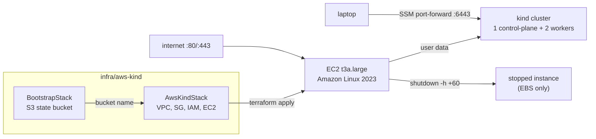

# AWS kind cluster on a single EC2 instance (CDKTF)

## Goal

Add an AWS counterpart to the local kind cluster: one EC2 instance in
`ap-southeast-1` that boots, installs Docker + kind + kubectl, creates a kind
cluster with the same topology as `infra/local-kind`, and stops itself after a
fixed lifetime (default 60 minutes) so the cluster never runs up a bill by
accident. Everything is defined with CDK for Terraform in TypeScript, matching
the existing stack, with Terraform state in S3.

Chosen over EKS because the control plane alone costs ~USD 73/month, and over
k3s because kind is what is already used locally, so the same add-ons and
manifests can be practised on both.

## Components

### `infra/aws-kind/` (new CDKTF project)

Same toolchain and layout as `infra/local-kind`: pnpm, ts-node, jest,
`cdktf.json` with `hashicorp/aws@~> 6.0`.

`main.ts` exports two stacks in one app:

1. **`BootstrapStack`** (`aws-bootstrap`) — local state. Creates one S3 bucket
   (`devops-tfstate-<account-id>`) with versioning, SSE-S3 encryption and
   public access blocked. Output: `bucket`.
2. **`AwsKindStack`** (`aws-kind`) — `S3Backend` on that bucket with
   `use_lockfile = true` (no DynamoDB). Resources:
   - VPC `10.42.0.0/16`, one public subnet `10.42.1.0/24`, internet gateway,
     route table + association. `map_public_ip_on_launch = true`.
   - Security group: ingress 80 and 443 from `0.0.0.0/0`, all egress. No 22,
     no 6443.
   - IAM role for EC2 with `AmazonSSMManagedInstanceCore` attached, and an
     instance profile.
   - `aws_instance`: `t3a.large`, latest Amazon Linux 2023 x86_64 AMI via SSM
     parameter `/aws/service/ami-amazon-linux-latest/al2023-ami-kernel-default-x86_64`,
     30 GB gp3 root, `instance_initiated_shutdown_behavior = "stop"`,
     IMDSv2 required, user data from `userData()`.
   - Terraform variables: `lifetime_minutes` (default 60).
   - Outputs: `instance_id`, `public_ip`.

`userData()` (pure function, unit tested) returns a bash script that:

- schedules `shutdown -h +${lifetime_minutes}` first, so the stop happens even
  if the install fails;
- installs Docker (`dnf install docker`), enables it, installs pinned kind and
  kubectl binaries;
- writes `/etc/kind/config.yaml` with the same node topology as the local
  cluster (control-plane with `ingress-ready` label, 80/443 port mappings, two
  workers) and creates cluster `devops-aws` as root;
- copies the kubeconfig to `/etc/kind/kubeconfig` (server stays
  `https://127.0.0.1:6443`).

The script runs on every boot (cloud-init `#cloud-boothook`-free approach: a
systemd oneshot unit written by user data, `kind-cluster.service`, so a
`make aws-start` after the auto-stop gets a fresh cluster and a fresh timer.

### Reaching the cluster

- `make aws-tunnel` — `aws ssm start-session --document-name AWS-StartPortForwardingSession`
  forwarding local 6443 to the instance's 6443.
- `make aws-kubeconfig` — `aws ssm send-command` runs `cat /etc/kind/kubeconfig`
  and writes it to `infra/aws-kind/kubeconfig` (git-ignored). Because kind's
  certificate already has `127.0.0.1` as a SAN and the tunnel lands on the
  same port, no rewriting is required.
- `make aws-status` — `kubectl --kubeconfig infra/aws-kind/kubeconfig get nodes`.

### Makefile targets

`aws-install`, `aws-test`, `aws-synth`, `aws-bootstrap` (deploy
`aws-bootstrap`), `aws-up` (deploy `aws-kind`), `aws-down` (destroy
`aws-kind`), `aws-start`, `aws-stop` (via `aws ec2 start/stop-instances` on the
`instance_id` output), `aws-tunnel`, `aws-kubeconfig`, `aws-status`.

### Docs

- `docs/aws-cluster.md` — how it works, prerequisites (AWS CLI + Session
  Manager plugin), cost table, usage.
- README: `What is here` row, roadmap update.
- `docs/TODO.md`: follow-ups (add `aws-kind` to Dagger CI, Elastic IP, Route 53,
  shared topology module between the two stacks).

## Testing

Jest on `Testing.synth(stack)`:

- bootstrap bucket has versioning enabled and public access blocked;
- instance is `t3a.large` with shutdown behaviour `stop` and IMDSv2 required;
- security group has no ingress rule on port 22 or 6443;
- IAM role has the SSM managed policy attached;
- user data begins with the `shutdown -h +` line and contains the three kind
  node roles;
- `aws-kind` synth contains an S3 backend with `use_lockfile`;
- `toBeValidTerraform()` for both stacks.

Manual verification: `make aws-bootstrap`, `make aws-up`, wait ~4 minutes,
`make aws-tunnel` + `make aws-kubeconfig` + `make aws-status` shows three
nodes; confirm the instance is stopped after the lifetime elapses.

## Cost (ap-southeast-1, on-demand)

| Item | Approx. |
| --- | --- |
| t3a.large running | USD 0.08 / hour |
| 30 GB gp3 while stopped | USD 2.9 / month |
| S3 state bucket | cents |

One hour of practice per day is roughly USD 5 / month.

## Out of scope

EKS, Elastic IP, DNS, CI synth of the new stack (listed in `docs/TODO.md`).
