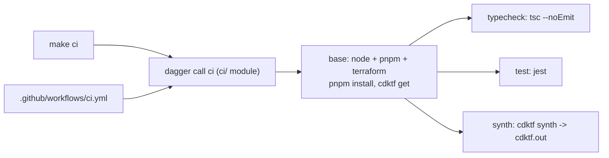

# CI/CD with GitHub Actions and Dagger (TypeScript)

## Goal

Run typecheck, unit tests and `cdktf synth` for `infra/local-kind` on every push to
`main` and every pull request, using a pipeline written once in TypeScript
(Dagger) that runs identically on a laptop and in GitHub Actions.

Out of scope: deploying the kind cluster from CI. `make local-up` stays local.

## Components

- `ci/` — Dagger module (`dagger.json`, `src/index.ts`). Class `Devops` exposes
  `base`, `typecheck`, `test`, `synth`, `ci`. `ci` runs the three checks
  concurrently and fails if any fails.
- `.github/workflows/ci.yml` — thin shim: checkout, install Dagger CLI, run
  `dagger call ci --source=.`. Concurrency group cancels superseded runs.
- `Makefile` — `ci`, `ci-typecheck`, `ci-test`, `ci-synth` targets calling the
  same Dagger functions.
- `docs/ci.md` — how the pipeline works and how to run it locally.

## Caching

pnpm store and the generated `.gen/` provider bindings live in Dagger cache
volumes keyed by lockfile / cdktf.json so repeat runs skip installs.

## Testing

Verified by running `make ci` locally against the Docker-backed Dagger engine
and by the workflow's first run on GitHub.
