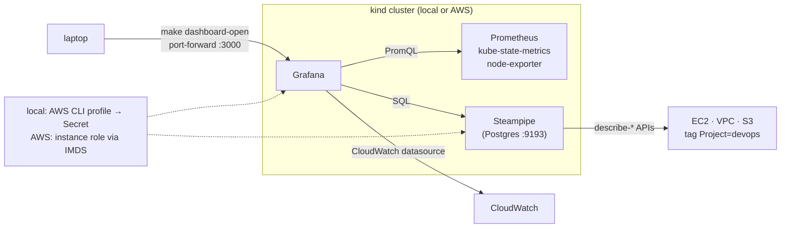

# In-cluster dashboard for Kubernetes and AWS resources (Grafana + Steampipe)

## Goal

Add a dashboard, hosted inside the kind cluster itself, that shows both the
cluster's Kubernetes resources and the AWS resources this repository creates.
The same add-on installs on `devops-local` and `devops-aws`. It is reached
only through `kubectl port-forward`; nothing is exposed publicly.

Grafana was chosen because it is the standard tool and needs no custom code:
Kubernetes panels come from Prometheus + kube-state-metrics, AWS time series
from the built-in CloudWatch datasource, and AWS inventory tables from
Steampipe queried as a plain PostgreSQL datasource. A custom exporter or a
Headlamp plugin would have meant code to maintain for the same result.

## Components

### `infra/dashboard/` (new CDKTF project)

Same toolchain and layout as the two existing stacks: pnpm, ts-node, jest,
`cdktf.json` with `hashicorp/helm@~> 3.0` and `hashicorp/kubernetes@~> 2.0`.
The app instantiates the stack twice, `dashboard-local` and `dashboard-aws`,
each with local, git-ignored Terraform state, so one target can be deployed
without touching the other.

`main.ts` exports one stack class, `DashboardStack`, taking:

| Prop | Meaning |
| --- | --- |
| `kubeconfigPath` | Path passed to both providers' `config_path` |
| `awsCredentials` | `"secret"` (local) or `"instance-role"` (AWS) |
| `region` | Region for CloudWatch and Steampipe (`ap-southeast-1`) |

Resources, all in namespace `dashboard`:

1. **Namespace** `dashboard`.
2. **Secret** `aws-credentials` (only when `awsCredentials === "secret"`):
   keys `AWS_ACCESS_KEY_ID`, `AWS_SECRET_ACCESS_KEY`, and optional
   `AWS_SESSION_TOKEN`, read from Terraform variables that the Makefile fills
   from `aws configure export-credentials`. Marked sensitive.
3. **Helm release** `kube-prometheus-stack` (chart from
   `https://prometheus-community.github.io/helm-charts`, pinned version).
   Values:
   - `grafana.adminPassword` from a Terraform variable (default `admin`,
     acceptable because access is port-forward only);
   - `grafana.sidecar.dashboards.enabled = true` so dashboards load from
     ConfigMaps labelled `grafana_dashboard=1`;
   - `grafana.additionalDataSources`: CloudWatch (auth `default`, region from
     props) and PostgreSQL named `steampipe` pointing at
     `steampipe.dashboard.svc:9193`, database `steampipe`, user `steampipe`,
     password from the Steampipe secret, `sslmode=disable`;
   - `grafana.envFromSecret = aws-credentials` when using the secret, so the
     CloudWatch datasource picks the keys up from the environment;
   - `alertmanager.enabled = false`; Prometheus retention 2 h with a 1 Gi
     emptyDir. Resource requests kept small (kind has no autoscaling).
4. **Steampipe** (`turbot/steampipe` image, pinned): a Deployment with one
   replica running `steampipe service start --foreground`, with an init container
   that installs the `aws` plugin into a shared emptyDir, a Service on 9193,
   a ConfigMap with `aws.spc` (region from props; credentials from the
   environment or the instance role), and a Secret holding the database
   password (`STEAMPIPE_DATABASE_PASSWORD`). The `aws-credentials` Secret is
   injected via `envFrom` when in secret mode.
5. **Dashboard ConfigMaps**, one per JSON file in `infra/dashboard/dashboards/`:
   - `aws-resources.json`: tables for the EC2 host (id, state, type, public
     IP, launch time), VPC/subnet/security-group rows and rules, S3 state
     bucket (name, versioning, encryption); all queries filter
     `tags ->> 'Project' = 'devops'`. Time-series panels for EC2 `CPUUtilization`,
     `NetworkIn/Out`, `StatusCheckFailed` via CloudWatch. A stat panel for the
     running cost estimate: instance hours this month from `aws_ec2_instance`
     launch time multiplied by the constant hourly price documented in
     `docs/aws-cluster.md`.
   - Kubernetes overview dashboards are the ones bundled with
     kube-prometheus-stack (cluster, namespaces, pods, nodes); no custom
     Kubernetes JSON is needed.
6. Outputs: `grafana_service` (`kube-prometheus-stack-grafana.dashboard.svc`)
   and the port-forward command.

### Changes to `infra/aws-kind/main.ts`

- Attach a new inline IAM policy to the host role allowing read-only calls used
  by the dashboard: `ec2:Describe*`, `s3:ListAllMyBuckets`, `s3:GetBucket*`,
  `cloudwatch:GetMetricData`, `cloudwatch:ListMetrics`,
  `cloudwatch:GetMetricStatistics`, `tag:GetResources`, `sts:GetCallerIdentity`.
  Scoped read-only rather than `ReadOnlyAccess`.
- `metadataOptions.httpPutResponseHopLimit = 2` so pods inside kind (one
  Docker hop away) can reach IMDSv2. Changing metadata options does not
  replace the instance.
- Tests for both.

### Makefile

| Target | Action |
| --- | --- |
| `dashboard-install` | `pnpm install && cdktf get` in `infra/dashboard` |
| `dashboard-test` | Jest tests |
| `dashboard-synth` | `cdktf synth` |
| `dashboard-local-up` | exports credentials from the AWS CLI profile into `TF_VAR_*` and deploys `dashboard-local` against `KUBECONFIG_LOCAL` |
| `dashboard-local-down` | destroys it |
| `dashboard-aws-up` / `dashboard-aws-down` | same against `KUBECONFIG_AWS`; requires `make aws-tunnel` running |
| `dashboard-open` | `kubectl port-forward -n dashboard svc/kube-prometheus-stack-grafana 3000:80`; `KUBECONFIG` chosen by `TARGET=local|aws` (default local) |

### CI

`ci/src/index.ts` gains a `stackDir` argument (default `infra/local-kind`) on
`base`, `typecheck`, `test` and `synth`, and `ci` runs the three steps for
`infra/local-kind`, `infra/aws-kind` and `infra/dashboard`. Synth for the AWS
stack sets `STATE_BUCKET=ci`. This closes the existing TODO item.

### Docs

- `docs/dashboard.md`: what it shows, the two credential paths, usage,
  memory note (kube-prometheus-stack plus Steampipe use roughly 1.5 GB;
  fine on the t3a.large, check Docker's memory limit locally).
- `docs/TODO.md`: tick the metrics item, add "ingress for the dashboard" and
  "whole-account inventory" as deferred.
- `Makefile` help lines and `docs/commands.md` row per new target.

## Data flow

1. Grafana starts, sidecar loads dashboards from ConfigMaps, datasources from
   the Helm values.
2. Kubernetes panels: Grafana → Prometheus → kube-state-metrics / kubelet /
   node-exporter.
3. AWS metric panels: Grafana CloudWatch plugin signs requests with the env
   credentials (local) or the instance role via IMDS (AWS).
4. AWS inventory panels: Grafana → PostgreSQL datasource → Steampipe, which
   calls `DescribeInstances`, `DescribeVpcs`, `ListBuckets` and friends on
   demand, caching for 5 minutes.

## Error handling

- Missing AWS credentials locally: `dashboard-local-up` fails fast with a
  message before Terraform runs (`aws configure export-credentials` non-zero).
- Steampipe unreachable: Grafana shows the datasource error on the AWS panels;
  Kubernetes panels keep working. Readiness probe on 9193 so the Service only
  routes to a ready pod.
- IMDS hop limit not applied (older instance): AWS panels error with
  `NoCredentialProviders`; documented in `docs/dashboard.md` troubleshooting.

## Testing

- Jest on synthesized Terraform: namespace, Helm release chart/version/values
  (datasources present, alertmanager disabled), Steampipe Deployment image
  pinned and `envFrom` only in secret mode, dashboard ConfigMaps carry the
  sidecar label and valid JSON, `terraform validate` with `-backend=false`.
- `aws-kind` tests: IAM policy attached, hop limit is 2.
- Manual: `make local-up dashboard-local-up dashboard-open`, then confirm the
  cluster dashboards and the AWS dashboard both render.

## Out of scope

Ingress or public exposure, authentication beyond the Grafana admin password,
whole-account inventory, alerting, persistent Prometheus storage.
